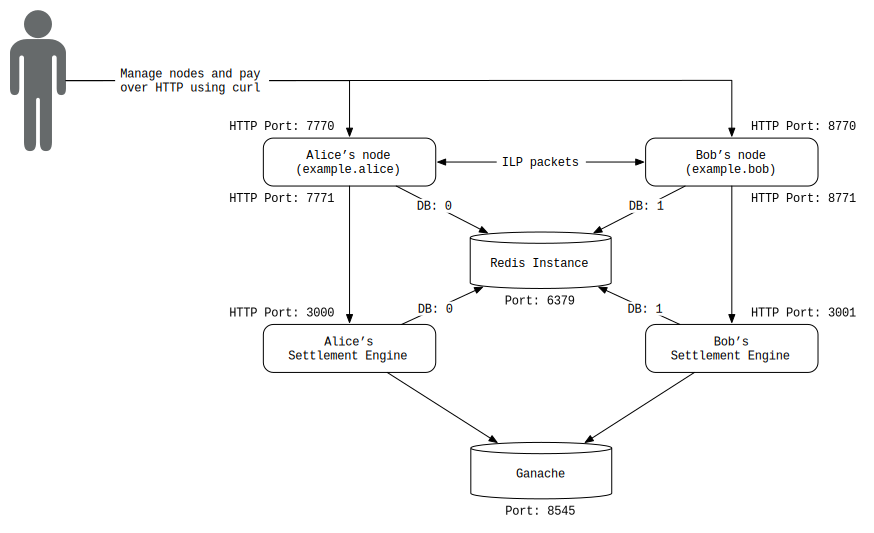

# Interledger with Ethereum On-Ledger Settlement
> A demo that sends payments between 2 Interledger.rs nodes and settles using Ethereum transactions.

## Overview
This example shows how to configure Interledger.rs nodes and use an Ethereum network (testnet or mainnet) as a settlement ledger for payments sent between the nodes. If you are new to Ethereum, you can learn about it [here](https://www.ethereum.org/beginners/). To learn about settlement in Interledger, refer to [Peering, Clearing and Settling](https://github.com/interledger/rfcs/blob/master/0032-peering-clearing-settlement/0032-peering-clearing-settlement.md).



## Prerequisites

- [Docker](#docker)
- [An Ethereum network](#an-ethereum-network) to connect to

### Docker
Because we provide docker images for node and others on [Docker Hub](https://hub.docker.com/u/interledgerrs), in this example we utilize it. You have to install Docker if you don't have already.

- Ubuntu: [Get Docker Engine - Community for Ubuntu](https://docs.docker.com/install/linux/docker-ce/ubuntu/)
- macOS: [Install Docker Desktop for Mac](https://docs.docker.com/docker-for-mac/install/)

### An Ethereum network
You need an Ethereum network. You can either use a local testnet, a remote testnet, or the mainnet.

For this example, we'll use the Docker image of [`ganache-cli`](https://hub.docker.com/r/trufflesuite/ganache-cli) which deploys a local Ethereum testnet at `localhost:8545`.

Advanced: You can run this against the Rinkeby Testnet by running a node that connects to Rinkeby (e.g. `geth --rinkeby --syncmode "light"`) or use a third-party node provider such as [Infura](https://infura.io/). You must also [create a wallet](https://www.myetherwallet.com/) and then obtain funds via the [Rinkeby Faucet](https://faucet.rinkeby.io/).

## Instructions

<!--!
docker --version > /dev/null || printf "\e[31mUh oh! You need to install Docker before running this example\e[m\n"

printf "Stopping Interledger nodes\n"

REDIS_CONTAINER_ID=`docker ps -q -f "name=redis"`
if [ ${REDIS_CONTAINER_ID} ]; then
    docker exec redis redis-cli flushall
fi

docker stop interledger-rs-node_a interledger-rs-node_b interledger-rs-se_a interledger-rs-se_b ganache redis 2> /dev/null
-->

### 0. Clean up Docker
If you have ever tried the other examples, clean up your docker because the names may conflict.

```bash #
docker stop `docker ps -aq -f "name=interledger-rs-node"`
docker rm `docker ps -aq -f "name=interledger-rs-node"`

docker stop `docker ps -aq -f "name=interledger-rs-se_"`
docker rm `docker ps -aq -f "name=interledger-rs-se_"`

docker stop `docker ps -aq -f "name=redis"`
docker rm `docker ps -aq -f "name=redis"`
```

### 1. Set up Docker
First, let's set up a docker network so that containers could connect each other.

<!--!
NETWORK_ID=`docker network ls -f "name=interledger" --format="{{.ID}}"`
if [ -z "${NETWORK_ID}" ]; then
    printf "Creating a docker network...\n"
    docker network create interledger
fi
-->
```bash #
docker network create interledger
```

### 2. Launch Redis

<!--!
printf "\nStarting Redis...\n"
-->

```bash
docker start redis ||
docker run --name redis -d -p 6379:6379 --network=interledger redis:5.0.5
```

When you want to watch logs, use the `docker logs` command. You can use the command like: `docker logs redis`.

### 3. Launch Ganache

This will launch an Ethereum testnet with 10 prefunded accounts. The mnemonic is used because we want to know the keys we'll use for Alice and Bob (otherwise they are randomized).

<!--!
printf "\nStarting local Ethereum testnet\n"
-->

```bash
docker start ganache ||
docker run \
        -p 8545:8545 \
        --network=interledger \
        --name=ganache \
        -id \
        trufflesuite/ganache-cli \
        -h 0.0.0.0 \
        -p 8545 \
        -m "abstract vacuum mammal awkward pudding scene penalty purchase dinner depart evoke puzzle" \
        -i 1
```

<!--! sleep 3 -->

### 4. Launch Settlement Engines
Because each node needs its own settlement engine, we need to launch both a settlement engine for Alice's node and another settlement engine for Bob's node.

<!--!
printf "\nStarting settlement engines...\n"
-->

```bash
# Start Alice's settlement engine
docker start interledger-rs-se_a ||
docker run \
    -p 3000:3000 \
    --network=interledger \
    --name=interledger-rs-se_a \
    -id \
    interledgerrs/settlement-engine ethereum-ledger \
    --key 380eb0f3d505f087e438eca80bc4df9a7faa24f868e69fc0440261a0fc0567dc \
    --confirmations 0 \
    --poll_frequency 1000 \
    --ethereum_endpoint http://ganache:8545 \
    --connector_url http://interledger-rs-node_a:7771 \
    --redis_uri redis://redis:6379/0 \
    --http_address 0.0.0.0:3000

# Start Bob's settlement engine
docker start interledger-rs-se_b ||
docker run \
    -p 3001:3000 \
    --network=interledger \
    --name=interledger-rs-se_b \
    -id \
    interledgerrs/settlement-engine ethereum-ledger \
    --key cc96601bc52293b53c4736a12af9130abf347669b3813f9ec4cafdf6991b087e \
    --confirmations 0 \
    --poll_frequency 1000 \
    --ethereum_endpoint http://ganache:8545 \
    --connector_url http://interledger-rs-node_b:7771 \
    --redis_uri redis://redis:6379/1 \
    --http_address 0.0.0.0:3000
```

### 5. Launch 2 Nodes

<!--!
printf "\nStarting nodes...\n"
-->

```bash
# Start Alice's node
docker start interledger-rs-node_a ||
docker run \
    -e ILP_ADDRESS=example.alice \
    -e ILP_SECRET_SEED=8852500887504328225458511465394229327394647958135038836332350604 \
    -e ILP_ADMIN_AUTH_TOKEN=hi_alice \
    -e ILP_REDIS_CONNECTION=redis://redis:6379/0 \
    -e ILP_HTTP_ADDRESS=0.0.0.0:7770 \
    -e ILP_BTP_ADDRESS=0.0.0.0:7768 \
    -e ILP_SETTLEMENT_ADDRESS=0.0.0.0:7771 \
    -p 7768:7768 \
    -p 7770:7770 \
    -p 7771:7771 \
    --network=interledger \
    --name=interledger-rs-node_a \
    -id \
    interledgerrs/node node

# Start Bob's node
docker start interledger-rs-node_b ||
docker run \
    -e ILP_ADDRESS=example.bob \
    -e ILP_SECRET_SEED=1604966725982139900555208458637022875563691455429373719368053354 \
    -e ILP_ADMIN_AUTH_TOKEN=hi_bob \
    -e ILP_REDIS_CONNECTION=redis://redis:6379/1 \
    -e ILP_HTTP_ADDRESS=0.0.0.0:7770 \
    -e ILP_BTP_ADDRESS=0.0.0.0:7768 \
    -e ILP_SETTLEMENT_ADDRESS=0.0.0.0:7771 \
    -p 8768:7768 \
    -p 8770:7770 \
    -p 8771:7771 \
    --network=interledger \
    --name=interledger-rs-node_b \
    -id \
    interledgerrs/node node
```

<!--!
printf "\nWaiting for Interledger.rs nodes to start up...\n"

function wait_to_serve() {
    while :
    do
        printf "."
        sleep 1
        curl $1 &> /dev/null
        if [ $? -eq 0 ]; then
            break;
        fi
    done
}

wait_to_serve "http://localhost:7770"
wait_to_serve "http://localhost:8770"
wait_to_serve "http://localhost:3000"
wait_to_serve "http://localhost:3001"
printf "\n"

printf "The Interledger.rs nodes are up and running!\n\n"
-->

### 6. Configure the Nodes

<!--! printf "Creating accounts:\n" -->

```bash
# Adding settlement accounts should be done at the same time because it checks each other

printf "Adding Alice's account...\n"
curl \
    -H "Content-Type: application/json" \
    -H "Authorization: Bearer hi_alice" \
    -d '{
    "username": "alice",
    "ilp_address": "example.alice",
    "asset_code": "ETH",
    "asset_scale": 18,
    "max_packet_amount": 100,
    "http_incoming_token": "in_alice",
    "http_endpoint": "http://interledger-rs-node_a:7770/ilp",
    "settle_to" : 0}' \
    http://localhost:7770/accounts > logs/account-alice-alice.log 2>/dev/null

printf "Adding Bob's Account...\n"
curl \
    -H "Content-Type: application/json" \
    -H "Authorization: Bearer hi_bob" \
    -d '{
    "username": "bob",
    "ilp_address": "example.bob",
    "asset_code": "ETH",
    "asset_scale": 18,
    "max_packet_amount": 100,
    "http_incoming_token": "in_bob",
    "http_endpoint": "http://interledger-rs-node_b:7770/ilp",
    "settle_to" : 0}' \
    http://localhost:8770/accounts > logs/account-bob-bob.log 2>/dev/null

printf "Adding Bob's account on Alice's node...\n"
curl \
    -H "Content-Type: application/json" \
    -H "Authorization: Bearer hi_alice" \
    -d '{
    "ilp_address": "example.bob",
    "username": "bob",
    "asset_code": "ETH",
    "asset_scale": 18,
    "max_packet_amount": 100,
    "settlement_engine_url": "http://interledger-rs-se_a:3000",
    "http_incoming_token": "bob_password",
    "http_outgoing_token": "alice:alice_password",
    "http_endpoint": "http://interledger-rs-node_b:7770/ilp",
    "settle_threshold": 500,
    "min_balance": -1000,
    "settle_to" : 0,
    "routing_relation": "Peer",
    "send_routes": true,
    "receive_routes": true}' \
    http://localhost:7770/accounts > logs/account-alice-bob.log 2>/dev/null &

printf "Adding Alice's account on Bob's node...\n"
curl \
    -H "Content-Type: application/json" \
    -H "Authorization: Bearer hi_bob" \
    -d '{
    "ilp_address": "example.alice",
    "username": "alice",
    "asset_code": "ETH",
    "asset_scale": 18,
    "max_packet_amount": 100,
    "settlement_engine_url": "http://interledger-rs-se_b:3000",
    "http_incoming_token": "alice_password",
    "http_outgoing_token": "bob:bob_password",
    "http_endpoint": "http://interledger-rs-node_a:7770/ilp",
    "settle_threshold": 500,
    "min_balance": -1000,
    "settle_to" : 0,
    "routing_relation": "Peer",
    "send_routes": true,
    "receive_routes": true}' \
    http://localhost:8770/accounts > logs/account-bob-alice.log 2>/dev/null &

sleep 2
```

Now two nodes and its settlement engines are set and accounts for each node are also set up.

Notice how we use Alice's settlement engine endpoint while registering Bob. This means that whenever Alice interacts with Bob's account, she'll use that Settlement Engine.

The `settle_threshold` and `settle_to` parameters control when settlements are triggered. The node will send a settlement when an account's balance reaches the `settle_threshold`, and it will settle for `balance - settle_to`.

### 7. Sending a Payment

<!--!
printf "\nChecking balances...\n"

printf "\nAlice's balance on Alice's node: "
curl \
-H "Authorization: Bearer alice:in_alice" \
http://localhost:7770/accounts/alice/balance

printf "\nBob's balance on Alice's node: "
curl \
-H "Authorization: Bearer bob:bob_password" \
http://localhost:7770/accounts/bob/balance

printf "\nAlice's balance on Bob's node: "
curl \
-H "Authorization: Bearer alice:alice_password" \
http://localhost:8770/accounts/alice/balance

printf "\nBob's balance on Bob's node: "
curl \
-H "Authorization: Bearer bob:in_bob" \
http://localhost:8770/accounts/bob/balance

printf "\n\n"
-->

The following script sends a payment from Alice to Bob.

<!--! printf "Sending payment of 500 from Alice to Bob\n" -->

```bash
curl \
    -H "Authorization: Bearer alice:in_alice" \
    -H "Content-Type: application/json" \
    -d "{\"receiver\":\"http://interledger-rs-node_b:7770/spsp/bob\",\"source_amount\":500}" \
    http://localhost:7770/pay
```

<!--! printf "\n\n" -->

### 8. Check Balances

```bash #
printf "\nAlice's balance on Alice's node: "
curl \
-H "Authorization: Bearer alice:in_alice" \
http://localhost:7770/accounts/alice/balance

printf "\nBob's balance on Alice's node: "
curl \
-H "Authorization: Bearer bob:bob_password" \
http://localhost:7770/accounts/bob/balance

printf "\nAlice's balance on Bob's node: "
curl \
-H "Authorization: Bearer alice:alice_password" \
http://localhost:8770/accounts/alice/balance

printf "\nBob's balance on Bob's node: "
curl \
-H "Authorization: Bearer bob:in_bob" \
http://localhost:8770/accounts/bob/balance
```

<!--!
printf "Checking balances...\n"
printf "\nAlice's balance on Alice's node: "
curl \
-H "Authorization: Bearer alice:in_alice" \
http://localhost:7770/accounts/alice/balance

printf "\nBob's balance on Alice's node: "
curl \
-H "Authorization: Bearer bob:bob_password" \
http://localhost:7770/accounts/bob/balance

printf "\nAlice's balance on Bob's node: "
AB_BALANCE=`curl \
-H "Authorization: Bearer alice:alice_password" \
http://localhost:8770/accounts/alice/balance 2>/dev/null`
EXPECTED_BALANCE='{"balance":"0"}'
if [[ $AB_BALANCE != $EXPECTED_BALANCE ]]; then
    INCOMING_NOT_SETTLED=1
    printf "\e[33m$AB_BALANCE\e[m"
else
    printf $AB_BALANCE
fi

printf "\nBob's balance on Bob's node: "
curl \
-H "Authorization: Bearer bob:in_bob" \
http://localhost:8770/accounts/bob/balance

if [ "$INCOMING_NOT_SETTLED" = "1" ]; then
    printf "\n\n\e[33mThis means the incoming settlement is not done yet. It will be done once the block is generated.\n"
    printf "Try the following command later:\n\n"
    printf "\tcurl -H \"Authorization: Bearer alice:alice_password\" http://localhost:8770/accounts/alice/balance\e[m"
fi
-->

### 9. Clear Redis
If you want to repeat the procedure, you can clear Redis data as follows.

```bash #
docker exec redis redis-cli flushall
```

### 10. Kill All the Services
Finally, you can stop all the services as follows:

<!--! printf "\n\nStopping Interledger nodes\n" -->

```bash #
docker stop interledger-rs-node_a interledger-rs-node_b interledger-rs-se_a interledger-rs-se_b ganache redis 
```

## Advanced

### Check the Settlement Block Generation
To check whether the settlement block is generated, we use `geth`. `geth` is the abbreviation of `go-ethereum` which is an Ethereum client written in the go language. If you don't already have `geth`, refer to the following.

- Compile and install from the source code
    - Refer to [Building Ethereum](https://github.com/ethereum/go-ethereum/wiki/Building-Ethereum) page.
- Install using package managers
    - Ubuntu: Follow the instructions [here](https://github.com/ethereum/go-ethereum/wiki/Installation-Instructions-for-Ubuntu).
    - macOS: If you use Homebrew, run `brew tap ethereum/ethereum` and `brew install ethereum`. Details are found [here](https://github.com/ethereum/go-ethereum/wiki/Installation-Instructions-for-Mac).
    - others: Refer to [Building Ethereum](https://github.com/ethereum/go-ethereum/wiki/Building-Ethereum) page.

Then dump transaction logs as follows. You will see generated block information. Be aware that ganache takes 10 to 20 seconds to generate a block. So you will have to wait for it before you check with `geth`.

<!-- # below means preventing output through run-md.sh -->
```bash #
printf "Last block: "
geth --exec "eth.getTransaction(eth.getBlock(eth.blockNumber-1).transactions[0])" attach http://localhost:8545 2>/dev/null
printf "\nCurrent block: "
geth --exec "eth.getTransaction(eth.getBlock(eth.blockNumber).transactions[0])" attach http://localhost:8545 2>/dev/null
```

<!--!
printf "\nYou could try the following command to check if a block is generated.\nTo check, you'll need to install geth.\n\n"
printf "To check the last block:\n"
printf "\tgeth --exec \"eth.getTransaction(eth.getBlock(eth.blockNumber-1).transactions[0])\" attach http://localhost:8545 2>/dev/null\n\n"
printf "To check the current block:\n"
printf "\tgeth --exec \"eth.getTransaction(eth.getBlock(eth.blockNumber).transactions[0])\" attach http://localhost:8545 2>/dev/null\n"
-->

If you inspect `ganache-cli`'s output, you will notice that the block number has increased as a result of the settlement executions as well.

## Troubleshooting

> Uh oh! You need to install Docker before running this example

You need to install Docker to run this example. See [Prerequisites](#prerequisites) section.

> docker: Error response from daemon: Conflict. The container name "/interledger-rs-node_a" is already in use by container "xxx".
> You have to remove (or rename) that container to be able to reuse that name.

You seem to have run the other example, try [0. Clean up Docker](#0-clean-up-docker) first.

## Conclusion

This example showed an SPSP payment sent between two Interledger.rs nodes that settled using on-ledger Ethereum transactions.

Check out the [other examples](../README.md) for more complex demos that show other features of Interledger, including multi-hop routing and cross-currency payments.
