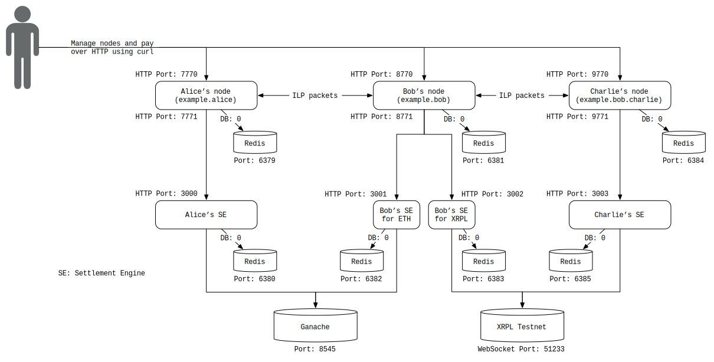

# Interledger with Ethereum and XRP On-Ledger Settlement

> A demo that sends payments between 3 Interledger.rs nodes and settles using Ethereum transactions and XRP transactions.

## Overview

This example shows how to configure Interledger.rs nodes and use an Ethereum network (testnet or mainnet) and the XRP Ledger testnet as settlement ledgers for payments sent between the nodes. If you are new to Ethereum, you can learn about it [here](https://www.ethereum.org/beginners/). You'll find many useful resources about the XRP Ledger (XRPL) [here](https://xrpl.org). To learn about settlement in Interledger, refer to [Peering, Clearing and Settling](https://github.com/interledger/rfcs/blob/master/0032-peering-clearing-settlement/0032-peering-clearing-settlement.md).

To run the full example, you can use [`run-md.sh`](../../scripts/run-md.sh) as described [here](../README.md). Otherwise, you can walk through each step below.

Each of the services write their logs to files found under the `logs` directory. You can run `tail -f logs/node_a.log`, for example, to watch the logs of Node A.



## Prerequisites

- [Rust](#rust)
- [An Ethereum network](#an-ethereum-network) to connect to
- [XRP Settlement Engine](#settlement*)
- [Redis](#redis)

### Rust

Because Interledger.rs is written in the Rust language, you need the Rust environment. Refer to the [Getting started](https://www.rust-lang.org/learn/get-started) page or just `curl https://sh.rustup.rs -sSf | sh` and follow the instructions.

### An Ethereum network

First, you need an Ethereum network. You can either use a local testnet, a remote testnet, or the mainnet.

For this example, we'll use [ganache-cli](https://github.com/trufflesuite/ganache-cli) which deploys a local Ethereum testnet at `localhost:8545`. To install `ganache-cli`, run `npm install -g ganache-cli`. If you do not already have Node.js installed on your computer, you can follow [the instructions below](#install-nodejs) to install it.

Advanced: You can run this against the Rinkeby Testnet by running a node that connects to Rinkeby (e.g. `geth --rinkeby --syncmode "light"`) or use a third-party node provider such as [Infura](https://infura.io/). You must also [create a wallet](https://www.myetherwallet.com/) and then obtain funds via the [Rinkeby Faucet](https://faucet.rinkeby.io/).

#### Install Node.js

(In case you don't have Node.js) There are a few ways to install Node.js. If you work on multiple JavaScript or TypeScript projects which require different `node` versions, using `nvm` may be suitable.

- [`nvm`](https://github.com/nvm-sh/nvm) (node version manager)
  - macOS: If you use [Homebrew](https://brew.sh/), run `brew install nvm` and you'll see some additional instructions. Follow it and `nvm install node` and `nvm use node`.
  - others: Refer to [`nvm`](https://github.com/nvm-sh/nvm) site.
- Install independently
  - macOS: If you use [Homebrew](https://brew.sh/), run `brew install node`
  - Ubuntu: `sudo apt-get install nodejs npm`

Then you should be able to use `npm`. To install `ganache-cli`, run `npm install -g ganache-cli`.

### XRP Settlement Engine

Interledger.rs and settlement engines written in other languages are fully interoperable. Here, we'll use the [XRP Ledger Settlement Engine](https://github.com/interledgerjs/settlement-xrp/), which is written in TypeScript. We'll need `node` and `npm` to install and run the settlement engine. If you don't have it already, refer to [Install Node.js](#install-nodejs).

Install the settlement engine as follows:

```bash #
npm i -g ilp-settlement-xrp
```

(This makes the `ilp-settlement-xrp` command available to your PATH.)

### Redis

The Interledger.rs nodes and settlement engines currently use [Redis](https://redis.io/) to store their data (SQL database support coming soon!). Nodes and settlement engines can use different Redis instances.

- Compile and install from the source code
  - [Download the source code here](https://redis.io/download)
- Install using package managers
  - Ubuntu: run `sudo apt-get install redis-server`
  - macOS: If you use Homebrew, run `brew install redis`

Make sure your Redis is empty. You could run `redis-cli flushall` to clear all the data.

## Instructions

<!--!
# import some functions from run-md-lib.sh
# this variable is set by run-md.sh
source $RUN_MD_LIB
init

printf "Stopping Interledger nodes\n"

if [ "$USE_DOCKER" -eq 1 ]; then
    $CMD_DOCKER --version > /dev/null || error_and_exit "Uh oh! You need to install Docker before running this example"
    mkdir -p logs

    $CMD_DOCKER stop \
        interledger-rs-node_a \
        interledger-rs-node_b \
        interledger-rs-node_c \
        interledger-rs-se_a \
        interledger-rs-se_b \
        interledger-rs-se_c \
        interledger-rs-se_d \
        redis-alice_node \
        redis-alice_se_eth \
        redis-bob_node \
        redis-bob_se_eth \
        redis-bob_se_xrp \
        redis-charlie_node \
        redis-charlie_se_xrp \
        ganache 2>/dev/null

    printf "\n\nRemoving existing Interledger containers\n"
    $CMD_DOCKER rm \
        interledger-rs-node_a \
        interledger-rs-node_b \
        interledger-rs-node_c \
        interledger-rs-se_a \
        interledger-rs-se_b \
        interledger-rs-se_c \
        interledger-rs-se_d \
        redis-alice_node \
        redis-alice_se_eth \
        redis-bob_node \
        redis-bob_se_eth \
        redis-bob_se_xrp \
        redis-charlie_node \
        redis-charlie_se_xrp \
        ganache 2>/dev/null
else
    for port in `seq 6379 6385`; do
        if lsof -Pi :${port} -sTCP:LISTEN -t ; then
            redis-cli -p ${port} shutdown
        fi
    done

    if [ -f dump.rdb ] ; then
        rm -f dump.rdb
    fi

    for port in 8545 7770 8770 9770 3000 3001 3002 3003; do
        if lsof -tPi :${port} ; then
            kill `lsof -tPi :${port}`
        fi
    done
fi
-->

### 1. Build interledger.rs

First of all, let's build interledger.rs. (This may take a couple of minutes)

<!--!
if [ "$USE_DOCKER" -eq 1 ]; then
    NETWORK_ID=`$CMD_DOCKER network ls -f "name=interledger" --format="{{.ID}}"`
    if [ -z "${NETWORK_ID}" ]; then
        printf "Creating a docker network...\n"
        $CMD_DOCKER network create interledger
    fi
else
    printf "Building interledger.rs... (This may take a couple of minutes)\n"
-->

```bash
cargo build --bin ilp-node
```

<!--!
fi
-->

### 2. Launch Redis

<!--!
printf "\nStarting Redis...\n"
if [ "$USE_DOCKER" -eq 1 ]; then
    $CMD_DOCKER run --name redis-alice_node -d -p 127.0.0.1:6379:6379 --network=interledger redis:5.0.5
    $CMD_DOCKER run --name redis-alice_se_eth -d -p 127.0.0.1:6380:6379 --network=interledger redis:5.0.5
    $CMD_DOCKER run --name redis-bob_node -d -p 127.0.0.1:6381:6379 --network=interledger redis:5.0.5
    $CMD_DOCKER run --name redis-bob_se_eth -d -p 127.0.0.1:6382:6379 --network=interledger redis:5.0.5
    $CMD_DOCKER run --name redis-bob_se_xrp -d -p 127.0.0.1:6383:6379 --network=interledger redis:5.0.5
    $CMD_DOCKER run --name redis-charlie_node -d -p 127.0.0.1:6384:6379 --network=interledger redis:5.0.5
    $CMD_DOCKER run --name redis-charlie_se_xrp -d -p 127.0.0.1:6385:6379 --network=interledger redis:5.0.5
else
    redis-server --version &> /dev/null || error_and_exit "Uh oh! You need to install redis-server before running this example"
-->

```bash
# Create the logs directory if it doesn't already exist
mkdir -p logs

# Start Redis
redis-server --port 6379 &> logs/redis-a-node.log &
redis-server --port 6380 &> logs/redis-a-se-eth.log &
redis-server --port 6381 &> logs/redis-b-node.log &
redis-server --port 6382 &> logs/redis-b-se-eth.log &
redis-server --port 6383 &> logs/redis-b-se-xrp.log &
redis-server --port 6384 &> logs/redis-c-node.log &
redis-server --port 6385 &> logs/redis-c-se-xrp.log &
```

<!--!
sleep 1
-->

To remove all the data in Redis, you might additionally perform:

```bash
for port in `seq 6379 6385`; do
    redis-cli -p $port flushall
done
```

<!--!
fi
-->

When you want to watch logs, use the `tail` command. You can use the command like: `tail -f logs/redis-alice.log`

### 3. Launch Ganache

This will launch an Ethereum testnet with 10 prefunded accounts. The mnemonic is used because we want to know the keys we'll use for Alice and Bob (otherwise they are randomized).

<!--!
printf "\nStarting local Ethereum testnet\n"

if [ "$USE_DOCKER" -eq 1 ]; then
    $CMD_DOCKER run \
        -p 127.0.0.1:8545:8545 \
        --network=interledger \
        --name=ganache \
        -id \
        trufflesuite/ganache-cli \
        -h 0.0.0.0 \
        -p 8545 \
        -m "abstract vacuum mammal awkward pudding scene penalty purchase dinner depart evoke puzzle" \
        -i 1
else
-->

```bash
ganache-cli -m "abstract vacuum mammal awkward pudding scene penalty purchase dinner depart evoke puzzle" -i 1 &> logs/ganache.log &
```

<!--!
fi
sleep 3
-->

### 4. Launch Settlement Engines

In this example, we'll connect 3 Interledger nodes and each node needs its own settlement engine for each settlement ledger; We'll launch 4 settlement engines in total.

1. A settlement engine for Alice to Bob on Ethereum
   - To settle the balance of Bob's account on Alice's node (Port 3000)
1. A settlement engine for Bob to Alice on Ethereum
   - To settle the balance of Alice's account on Bob's node (Port 3001)
1. A settlement engine for Bob to Charlie on XRPL
   - To settle the balance of Charlie's account on Bob's node (Port 3002)
1. A settlement engine for Charlie to Bob on XRPL
   - To settle the balance of Bob's account on Charlie's node (Port 3003)

By default, the XRP settlement engine generates new testnet XRPL accounts prefunded with 1,000 testnet XRP (a new account is generated each run). Alternatively, you may supply an `XRP_SECRET` environment variable by generating your own testnet credentials from the [official faucet](https://xrpl.org/xrp-test-net-faucet.html).

The engines are part of a [separate repository](https://github.com/interledger-rs/settlement-engines) so you have to clone and install them according to [the instructions in settlement-engine](https://github.com/interledger-rs/settlement-engines/blob/master/README.md). In case you've never cloned `settlement-engine`, the first step would be to clone the repository.

<!--!
printf "\nStarting settlement engines...\n"
if [ "$USE_DOCKER" -eq 1 ]; then
    # Start Alice's settlement engine (ETH)
    $CMD_DOCKER run \
        -p 127.0.0.1:3000:3000 \
        --network=interledger \
        --name=interledger-rs-se_a \
        -td \
        interledgerrs/settlement-engines ethereum-ledger \
        --private_key 380eb0f3d505f087e438eca80bc4df9a7faa24f868e69fc0440261a0fc0567dc \
        --confirmations 0 \
        --poll_frequency 1000 \
        --ethereum_url http://ganache:8545 \
        --connector_url http://interledger-rs-node_a:7771 \
        --redis_url redis://redis-alice_se_eth:6379/ \
        --asset_scale 6 \
        --settlement_api_bind_address 0.0.0.0:3000

    # Start Bob's settlement engine (ETH, XRPL)
    $CMD_DOCKER run \
        -p 127.0.0.1:3001:3000 \
        --network=interledger \
        --name=interledger-rs-se_b \
        -td \
        interledgerrs/settlement-engines ethereum-ledger \
        --private_key cc96601bc52293b53c4736a12af9130abf347669b3813f9ec4cafdf6991b087e \
        --confirmations 0 \
        --poll_frequency 1000 \
        --ethereum_url http://ganache:8545 \
        --connector_url http://interledger-rs-node_b:7771 \
        --redis_url redis://redis-bob_se_eth:6379/ \
        --asset_scale 6 \
        --settlement_api_bind_address 0.0.0.0:3000

    $CMD_DOCKER run \
        -p 127.0.0.1:3002:3000 \
        --network=interledger \
        --name=interledger-rs-se_c \
        -id \
        -e DEBUG=settlement* \
        -e CONNECTOR_URL=http://interledger-rs-node_b:7771 \
        -e REDIS_URI=redis-bob_se_xrp \
        interledgerjs/settlement-xrp

    # Start Charlie's settlement engine (XRPL)
    $CMD_DOCKER run \
        -p 127.0.0.1:3003:3000 \
        --network=interledger \
        --name=interledger-rs-se_d \
        -id \
        -e DEBUG=settlement* \
        -e CONNECTOR_URL=http://interledger-rs-node_c:7771 \
        -e REDIS_URI=redis-charlie_se_xrp \
        interledgerjs/settlement-xrp
else
    which ilp-settlement-xrp &> /dev/null || error_and_exit "You need to install \"ilp-settlement-xrp\"."
    pushd "${SETTLEMENT_ENGINE_INSTALLL_DIR}" &>/dev/null
    if [ ! -e "settlement-engines" ]; then
        git clone https://github.com/interledger-rs/settlement-engines
    fi
    pushd settlement-engines &>/dev/null
-->

```bash #
# This should be done outside of the interledger-rs directory, otherwise it will cause an error
git clone https://github.com/interledger-rs/settlement-engines
cd settlement-engines
```

Then, spin up your settlement engines.

```bash
# Turn on debug logging for all of the interledger.rs components
export RUST_LOG=interledger=debug
mkdir -p logs

cargo build --features "ethereum" --bin interledger-settlement-engines

# Start Alice's settlement engine (ETH)
cargo run --features "ethereum" -- ethereum-ledger \
--private_key 380eb0f3d505f087e438eca80bc4df9a7faa24f868e69fc0440261a0fc0567dc \
--confirmations 0 \
--poll_frequency 1000 \
--ethereum_url http://127.0.0.1:8545 \
--connector_url http://127.0.0.1:7771 \
--redis_url redis://127.0.0.1:6380/ \
--asset_scale 6 \
--settlement_api_bind_address 127.0.0.1:3000 \
&> logs/node-alice-settlement-engine-eth.log &

# Start Bob's settlement engine (ETH, XRPL)
cargo run --features "ethereum" -- ethereum-ledger \
--private_key cc96601bc52293b53c4736a12af9130abf347669b3813f9ec4cafdf6991b087e \
--confirmations 0 \
--poll_frequency 1000 \
--ethereum_url http://127.0.0.1:8545 \
--connector_url http://127.0.0.1:8771 \
--redis_url redis://127.0.0.1:6382/ \
--asset_scale 6 \
--settlement_api_bind_address 127.0.0.1:3001 \
&> logs/node-bob-settlement-engine-eth.log &

# Now go back to the `interledger-rs` directory.

DEBUG="settlement*" \
CONNECTOR_URL="http://localhost:8771" \
REDIS_URI=127.0.0.1:6383 \
ENGINE_PORT=3002 \
ilp-settlement-xrp \
&> logs/node-bob-settlement-engine-xrpl.log &

# Start Charlie's settlement engine (XRPL)
DEBUG="settlement*" \
CONNECTOR_URL="http://localhost:9771" \
REDIS_URI=127.0.0.1:6385 \
ENGINE_PORT=3003 \
ilp-settlement-xrp \
&> logs/node-charlie-settlement-engine-xrpl.log &
```

<!--!
    popd &>/dev/null
    popd &>/dev/null
fi
-->

### 5. Launch 3 Nodes

<!--!
printf "\nStarting nodes...\n"
if [ "$USE_DOCKER" -eq 1 ]; then
    # Start Alice's node
    $CMD_DOCKER run \
        -e ILP_ADDRESS=example.alice \
        -e ILP_SECRET_SEED=8852500887504328225458511465394229327394647958135038836332350604 \
        -e ILP_ADMIN_AUTH_TOKEN=hi_alice \
        -e ILP_REDIS_URL=redis://redis-alice_node:6379/ \
        -e ILP_HTTP_BIND_ADDRESS=0.0.0.0:7770 \
        -e ILP_SETTLEMENT_API_BIND_ADDRESS=0.0.0.0:7771 \
        -p 127.0.0.1:7770:7770 \
        -p 127.0.0.1:7771:7771 \
        --network=interledger \
        --name=interledger-rs-node_a \
        -td \
        interledgerrs/node

    # Start Bob's node
    $CMD_DOCKER run \
        -e ILP_ADDRESS=example.bob \
        -e ILP_SECRET_SEED=1604966725982139900555208458637022875563691455429373719368053354 \
        -e ILP_ADMIN_AUTH_TOKEN=hi_bob \
        -e ILP_REDIS_URL=redis://redis-bob_node:6379/ \
        -e ILP_HTTP_BIND_ADDRESS=0.0.0.0:7770 \
        -e ILP_SETTLEMENT_API_BIND_ADDRESS=0.0.0.0:7771 \
        -p 127.0.0.1:8770:7770 \
        -p 127.0.0.1:8771:7771 \
        --network=interledger \
        --name=interledger-rs-node_b \
        -td \
        interledgerrs/node

    # Start Charlie's node
    $CMD_DOCKER run \
        -e ILP_SECRET_SEED=1232362131122139900555208458637022875563691455429373719368053354 \
        -e ILP_ADMIN_AUTH_TOKEN=hi_charlie \
        -e ILP_REDIS_URL=redis://redis-charlie_node:6379/ \
        -e ILP_HTTP_BIND_ADDRESS=0.0.0.0:7770 \
        -e ILP_SETTLEMENT_API_BIND_ADDRESS=0.0.0.0:7771 \
        -p 127.0.0.1:9770:7770 \
        -p 127.0.0.1:9771:7771 \
        --network=interledger \
        --name=interledger-rs-node_c \
        -td \
        interledgerrs/node
else
-->

```bash
# Start Alice's node
ILP_ADDRESS=example.alice \
ILP_SECRET_SEED=8852500887504328225458511465394229327394647958135038836332350604 \
ILP_ADMIN_AUTH_TOKEN=hi_alice \
ILP_REDIS_URL=redis://127.0.0.1:6379/ \
ILP_HTTP_BIND_ADDRESS=127.0.0.1:7770 \
ILP_SETTLEMENT_API_BIND_ADDRESS=127.0.0.1:7771 \
cargo run --bin ilp-node &> logs/node-alice.log &

# Start Bob's node
ILP_ADDRESS=example.bob \
ILP_SECRET_SEED=1604966725982139900555208458637022875563691455429373719368053354 \
ILP_ADMIN_AUTH_TOKEN=hi_bob \
ILP_REDIS_URL=redis://127.0.0.1:6381/ \
ILP_HTTP_BIND_ADDRESS=127.0.0.1:8770 \
ILP_SETTLEMENT_API_BIND_ADDRESS=127.0.0.1:8771 \
cargo run --bin ilp-node &> logs/node-bob.log &

# Start Charlie's node
ILP_SECRET_SEED=1232362131122139900555208458637022875563691455429373719368053354 \
ILP_ADMIN_AUTH_TOKEN=hi_charlie \
ILP_REDIS_URL=redis://127.0.0.1:6384/ \
ILP_HTTP_BIND_ADDRESS=127.0.0.1:9770 \
ILP_SETTLEMENT_API_BIND_ADDRESS=127.0.0.1:9771 \
cargo run --bin ilp-node &> logs/node-charlie.log &
```

<!--!
fi

printf "\nWaiting for nodes to start up"

wait_to_serve "http://localhost:7770" 10 || error_and_exit "\nFailed to spin up nodes. Check out your configuration and log files."
wait_to_serve "http://localhost:8770" 10 || error_and_exit "\nFailed to spin up nodes. Check out your configuration and log files."
wait_to_serve "http://localhost:9770" 10 || error_and_exit "\nFailed to spin up nodes. Check out your configuration and log files."
wait_to_serve "http://localhost:3000" 10 || error_and_exit "\nFailed to spin up nodes. Check out your configuration and log files."
wait_to_serve "http://localhost:3001" 10 || error_and_exit "\nFailed to spin up nodes. Check out your configuration and log files."
wait_to_serve "http://localhost:3002" 10 || error_and_exit "\nFailed to spin up nodes. Check out your configuration and log files."
wait_to_serve "http://localhost:3003" 10 || error_and_exit "\nFailed to spin up nodes. Check out your configuration and log files."

printf "done\nThe Interledger.rs nodes are up and running!\n\n"
-->

### 6. Configure the Nodes

<!--!
printf "Creating accounts:\n"
if [ "$USE_DOCKER" -eq 1 ]; then
    # Adding settlement accounts should be done at the same time because it checks each other

    printf "Adding Alice's account...\n"
    curl \
        -H "Content-Type: application/json" \
        -H "Authorization: Bearer hi_alice" \
        -d '{
        "username" : "alice",
        "ilp_address": "example.alice",
        "asset_code": "ETH",
        "asset_scale": 6,
        "max_packet_amount": 100,
        "ilp_over_http_incoming_token": "alice_password",
        "ilp_over_http_url": "http://interledger-rs-node_a:7770/ilp",
        "settle_to" : 0}' \
        http://localhost:7770/accounts > logs/account-alice-alice.log 2>/dev/null

    printf "Adding Charlie's Account...\n"
    curl \
        -H "Content-Type: application/json" \
        -H "Authorization: Bearer hi_charlie" \
        -d '{
        "ilp_address": "example.bob.charlie",
        "username" : "charlie",
        "asset_code": "XRP",
        "asset_scale": 6,
        "max_packet_amount": 100,
        "ilp_over_http_incoming_token": "charlie_password",
        "ilp_over_http_url": "http://interledger-rs-node_c:7770/ilp",
        "settle_to" : 0}' \
        http://localhost:9770/accounts > logs/account-charlie-charlie.log 2>/dev/null

    printf "Adding Bob's account on Alice's node (ETH Peer relation)...\n"
    curl \
        -H "Content-Type: application/json" \
        -H "Authorization: Bearer hi_alice" \
        -d '{
        "ilp_address": "example.bob",
        "username" : "bob",
        "asset_code": "ETH",
        "asset_scale": 6,
        "max_packet_amount": 100,
        "settlement_engine_url": "http://interledger-rs-se_a:3000",
        "ilp_over_http_incoming_token": "bob_password",
        "ilp_over_http_outgoing_token": "alice:alice_password",
        "ilp_over_http_url": "http://interledger-rs-node_b:7770/ilp",
        "settle_threshold": 500,
        "min_balance": -1000,
        "settle_to" : 0,
        "routing_relation": "Peer"}' \
        http://localhost:7770/accounts > logs/account-alice-bob.log 2>/dev/null &

    printf "Adding Alice's account on Bob's node (ETH Peer relation)...\n"
    curl \
        -H "Content-Type: application/json" \
        -H "Authorization: Bearer hi_bob" \
        -d '{
        "ilp_address": "example.alice",
        "username": "alice",
        "asset_code": "ETH",
        "asset_scale": 6,
        "max_packet_amount": 100,
        "settlement_engine_url": "http://interledger-rs-se_b:3000",
        "ilp_over_http_incoming_token": "alice_password",
        "ilp_over_http_outgoing_token": "bob:bob_password",
        "ilp_over_http_url": "http://interledger-rs-node_a:7770/ilp",
        "settle_threshold": 500,
        "min_balance": -1000,
        "settle_to" : 0,
        "routing_relation": "Peer"}' \
        http://localhost:8770/accounts > logs/account-bob-alice.log 2>/dev/null

    printf "Adding Charlie's account on Bob's node (XRP Child relation)...\n"
    curl \
        -H "Content-Type: application/json" \
        -H "Authorization: Bearer hi_bob" \
        -d '{
        "ilp_address": "example.bob.charlie",
        "username" : "charlie",
        "asset_code": "XRP",
        "asset_scale": 6,
        "max_packet_amount": 100,
        "settlement_engine_url": "http://interledger-rs-se_c:3000",
        "ilp_over_http_incoming_token": "charlie_password",
        "ilp_over_http_outgoing_token": "bob:bob_other_password",
        "ilp_over_http_url": "http://interledger-rs-node_c:7770/ilp",
        "settle_threshold": 500,
        "min_balance": -1000,
        "settle_to" : 0,
        "routing_relation": "Child"}' \
        http://localhost:8770/accounts > logs/account-bob-charlie.log 2>/dev/null &

    printf "Adding Bob's account on Charlie's node (XRP Parent relation)...\n"
    curl \
        -H "Content-Type: application/json" \
        -H "Authorization: Bearer hi_charlie" \
        -d '{
        "ilp_address": "example.bob",
        "username" : "bob",
        "asset_code": "XRP",
        "asset_scale": 6,
        "max_packet_amount": 100,
        "settlement_engine_url": "http://interledger-rs-se_d:3000",
        "ilp_over_http_incoming_token": "bob_other_password",
        "ilp_over_http_outgoing_token": "charlie:charlie_password",
        "ilp_over_http_url": "http://interledger-rs-node_b:7770/ilp",
        "settle_threshold": 500,
        "min_balance": -1000,
        "settle_to" : 0,
        "routing_relation": "Parent"}' \
        http://localhost:9770/accounts > logs/account-charlie-bob.log 2>/dev/null

    sleep 2
else
-->

```bash
# Adding settlement accounts should be done at the same time because it checks each other

printf "Adding Alice's account...\n"
curl \
    -H "Content-Type: application/json" \
    -H "Authorization: Bearer hi_alice" \
    -d '{
    "username" : "alice",
    "ilp_address": "example.alice",
    "asset_code": "ETH",
    "asset_scale": 6,
    "max_packet_amount": 100,
    "ilp_over_http_incoming_token": "alice_password",
    "ilp_over_http_url": "http://localhost:7770/ilp",
    "settle_to" : 0}' \
    http://localhost:7770/accounts > logs/account-alice-alice.log 2>/dev/null

printf "Adding Charlie's Account...\n"
curl \
    -H "Content-Type: application/json" \
    -H "Authorization: Bearer hi_charlie" \
    -d '{
    "ilp_address": "example.bob.charlie",
    "username" : "charlie",
    "asset_code": "XRP",
    "asset_scale": 6,
    "max_packet_amount": 100,
    "ilp_over_http_incoming_token": "charlie_password",
    "ilp_over_http_url": "http://localhost:9770/ilp",
    "settle_to" : 0}' \
    http://localhost:9770/accounts > logs/account-charlie-charlie.log 2>/dev/null

printf "Adding Bob's account on Alice's node (ETH Peer relation)...\n"
curl \
    -H "Content-Type: application/json" \
    -H "Authorization: Bearer hi_alice" \
    -d '{
    "ilp_address": "example.bob",
    "username" : "bob",
    "asset_code": "ETH",
    "asset_scale": 6,
    "max_packet_amount": 100,
    "settlement_engine_url": "http://localhost:3000",
    "ilp_over_http_incoming_token": "bob_password",
    "ilp_over_http_outgoing_token": "alice:alice_password",
    "ilp_over_http_url": "http://localhost:8770/ilp",
    "settle_threshold": 500,
    "min_balance": -1000,
    "settle_to" : 0,
    "routing_relation": "Peer"}' \
    http://localhost:7770/accounts > logs/account-alice-bob.log 2>/dev/null &

printf "Adding Alice's account on Bob's node (ETH Peer relation)...\n"
curl \
    -H "Content-Type: application/json" \
    -H "Authorization: Bearer hi_bob" \
    -d '{
    "ilp_address": "example.alice",
    "username": "alice",
    "asset_code": "ETH",
    "asset_scale": 6,
    "max_packet_amount": 100,
    "settlement_engine_url": "http://localhost:3001",
    "ilp_over_http_incoming_token": "alice_password",
    "ilp_over_http_outgoing_token": "bob:bob_password",
    "ilp_over_http_url": "http://localhost:7770/ilp",
    "settle_threshold": 500,
    "min_balance": -1000,
    "settle_to" : 0,
    "routing_relation": "Peer"}' \
    http://localhost:8770/accounts > logs/account-bob-alice.log 2>/dev/null

printf "Adding Charlie's account on Bob's node (XRP Child relation)...\n"
curl \
    -H "Content-Type: application/json" \
    -H "Authorization: Bearer hi_bob" \
    -d '{
    "ilp_address": "example.bob.charlie",
    "username" : "charlie",
    "asset_code": "XRP",
    "asset_scale": 6,
    "max_packet_amount": 100,
    "settlement_engine_url": "http://localhost:3002",
    "ilp_over_http_incoming_token": "charlie_password",
    "ilp_over_http_outgoing_token": "bob:bob_other_password",
    "ilp_over_http_url": "http://localhost:9770/ilp",
    "settle_threshold": 500,
    "min_balance": -1000,
    "settle_to" : 0,
    "routing_relation": "Child"}' \
    http://localhost:8770/accounts > logs/account-bob-charlie.log 2>/dev/null &

printf "Adding Bob's account on Charlie's node (XRP Parent relation)...\n"
curl \
    -H "Content-Type: application/json" \
    -H "Authorization: Bearer hi_charlie" \
    -d '{
    "ilp_address": "example.bob",
    "username" : "bob",
    "asset_code": "XRP",
    "asset_scale": 6,
    "max_packet_amount": 100,
    "settlement_engine_url": "http://localhost:3003",
    "ilp_over_http_incoming_token": "bob_other_password",
    "ilp_over_http_outgoing_token": "charlie:charlie_password",
    "ilp_over_http_url": "http://localhost:8770/ilp",
    "settle_threshold": 500,
    "min_balance": -1000,
    "settle_to" : 0,
    "routing_relation": "Parent"}' \
    http://localhost:9770/accounts > logs/account-charlie-bob.log 2>/dev/null

sleep 2
```

<!--!
fi
-->

Now three nodes and its settlement engines are set and accounts for each node are also set up.

Notice how we use Alice's settlement engine endpoint while registering Bob. This means that whenever Alice interacts with Bob's account, she'll use that Settlement Engine. This could be also said for the other accounts on the other nodes.

The `settle_threshold` and `settle_to` parameters control when settlements are triggered. The node will send a settlement when an account's balance reaches the `settle_threshold`, and it will settle for `balance - settle_to`.

### 7. Set the exchange rate between ETH and XRP on Bob's connector

```bash
printf "\nSetting the exchange rate...\n"
curl http://localhost:8770/rates -X PUT \
    -H "Content-Type: application/json" \
    -H "Authorization: Bearer hi_bob" \
    -d "{ \"ETH\" : 1, \"XRP\": 1 }" \
    &>/dev/null
```

### 8. Sending a Payment

<!--!
printf "\nChecking balances...\n"

printf "\nAlice's balance on Alice's node: "
curl \
-H "Authorization: Bearer hi_alice" \
http://localhost:7770/accounts/alice/balance

printf "\nBob's balance on Alice's node: "
curl \
-H "Authorization: Bearer hi_alice" \
http://localhost:7770/accounts/bob/balance

printf "\nAlice's balance on Bob's node: "
curl \
-H "Authorization: Bearer hi_bob" \
http://localhost:8770/accounts/alice/balance

printf "\nCharlie's balance on Bob's node: "
curl \
-H "Authorization: Bearer hi_bob" \
http://localhost:8770/accounts/charlie/balance

printf "\nBob's balance on Charlie's node: "
curl \
-H "Authorization: Bearer hi_charlie" \
http://localhost:9770/accounts/bob/balance

printf "\nCharlie's balance on Charlie's node: "
curl \
-H "Authorization: Bearer hi_charlie" \
http://localhost:9770/accounts/charlie/balance

printf "\n\n"
-->

The following script sends a payment from Alice to Charlie through Bob.

<!--!
printf "Sending payment of 500 from Alice to Charlie through Bob\n"

if [ "$USE_DOCKER" -eq 1 ]; then
    curl \
        -H "Authorization: Bearer alice:alice_password" \
        -H "Content-Type: application/json" \
        -d "{\"receiver\":\"http://interledger-rs-node_c:7770/accounts/charlie/spsp\",\"source_amount\":500}" \
        http://localhost:7770/accounts/alice/payments
else
-->

```bash
curl \
    -H "Authorization: Bearer alice:alice_password" \
    -H "Content-Type: application/json" \
    -d "{\"receiver\":\"http://localhost:9770/accounts/charlie/spsp\",\"source_amount\":500}" \
    http://localhost:7770/accounts/alice/payments
```

<!--!
fi

printf "\n"

# wait untill the settlement is done
printf "\nWaiting for Ethereum block to be mined"
wait_to_get_http_response_body '{"balance":"0"}' 10 -H "Authorization: Bearer hi_bob" "http://localhost:8770/accounts/alice/balance"
printf "done\n"

printf "Waiting for XRP ledger to be validated"
wait_to_get_http_response_body '{"balance":"0"}' 10 -H "Authorization: Bearer hi_charlie" "http://localhost:9770/accounts/bob/balance"
printf "done\n"
-->

### 8. Check Balances

You may see unsettled balances before the settlement engines exactly work. Wait a few seconds and try later.

```bash #
printf "\nAlice's balance on Alice's node: "
curl \
-H "Authorization: Bearer hi_alice" \
http://localhost:7770/accounts/alice/balance

printf "\nBob's balance on Alice's node: "
curl \
-H "Authorization: Bearer hi_alice" \
http://localhost:7770/accounts/bob/balance

printf "\nAlice's balance on Bob's node: "
curl \
-H "Authorization: Bearer hi_bob" \
http://localhost:8770/accounts/alice/balance

printf "\nCharlie's balance on Bob's node: "
curl \
-H "Authorization: Bearer hi_bob" \
http://localhost:8770/accounts/charlie/balance

printf "\nBob's balance on Charlie's node: "
curl \
-H "Authorization: Bearer hi_charlie" \
http://localhost:9770/accounts/bob/balance

printf "\nCharlie's balance on Charlie's node: "
curl \
-H "Authorization: Bearer hi_charlie" \
http://localhost:9770/accounts/charlie/balance
```

<!--!
printf "\nChecking balances...\n"

printf "\nAlice's balance on Alice's node: "
curl \
-H "Authorization: Bearer hi_alice" \
http://localhost:7770/accounts/alice/balance

printf "\nBob's balance on Alice's node: "
curl \
-H "Authorization: Bearer hi_alice" \
http://localhost:7770/accounts/bob/balance

printf "\nAlice's balance on Bob's node: "
curl \
-H "Authorization: Bearer hi_bob" \
http://localhost:8770/accounts/alice/balance

printf "\nCharlie's balance on Bob's node: "
curl \
-H "Authorization: Bearer hi_bob" \
http://localhost:8770/accounts/charlie/balance

printf "\nBob's balance on Charlie's node: "
curl \
-H "Authorization: Bearer hi_charlie" \
http://localhost:9770/accounts/bob/balance

printf "\nCharlie's balance on Charlie's node: "
curl \
-H "Authorization: Bearer hi_charlie" \
http://localhost:9770/accounts/charlie/balance
-->

### 9. Kill All the Services

Finally, you can stop all the services as follows:

```bash #
for port in `seq 6379 6385`; do
    if lsof -Pi :${port} -sTCP:LISTEN -t >/dev/null ; then
        redis-cli -p ${port} shutdown
    fi
done

if [ -f dump.rdb ] ; then
    rm -f dump.rdb
fi

for port in 8545 7770 8770 9770 3000 3001 3002 3003; do
    if lsof -tPi :${port} >/dev/null ; then
        kill `lsof -tPi :${port}`
    fi
done
```

If you are using Docker, try the following.

```bash #
# Depending on your OS, you might not need to prefix with `sudo` necessarily.
sudo docker stop \
    interledger-rs-node_a \
    interledger-rs-node_b \
    interledger-rs-node_c \
    interledger-rs-se_a \
    interledger-rs-se_b \
    interledger-rs-se_c \
    interledger-rs-se_d \
    redis-alice_node \
    redis-alice_se_eth \
    redis-bob_node \
    redis-bob_se_eth \
    redis-bob_se_xrp \
    redis-charlie_node \
    redis-charlie_se_xrp \
    ganache
```

## Advanced

### Check the Settlement Block Generation

To check whether the settlement block is generated, we use `geth`. `geth` is the abbreviation of `go-ethereum` which is an Ethereum client written in the go language. If you don't already have `geth`, refer to the following.

- Compile and install from the source code
  - Refer to [Building Ethereum](https://github.com/ethereum/go-ethereum/wiki/Building-Ethereum) page.
- Install using package managers
  - Ubuntu: Follow the instructions [here](https://github.com/ethereum/go-ethereum/wiki/Installation-Instructions-for-Ubuntu).
  - macOS: If you use Homebrew, run `brew tap ethereum/ethereum` and `brew install ethereum`. Details are found [here](https://github.com/ethereum/go-ethereum/wiki/Installation-Instructions-for-Mac).
  - others: Refer to [Building Ethereum](https://github.com/ethereum/go-ethereum/wiki/Building-Ethereum) page.

Then dump transaction logs as follows. You will see generated block information. Be aware that ganache takes 10 to 20 seconds to generate a block. So you will have to wait for it before you check with `geth`.

<!-- # below means preventing output through run-md.sh -->

```bash #
printf "Last block: "
geth --exec "eth.getTransaction(eth.getBlock(eth.blockNumber-1).transactions[0])" attach http://localhost:8545 2>/dev/null
printf "\nCurrent block: "
geth --exec "eth.getTransaction(eth.getBlock(eth.blockNumber).transactions[0])" attach http://localhost:8545 2>/dev/null
```

If you inspect `ganache-cli`'s output, you will notice that the block number has increased as a result of the settlement executions as well.

### Check the Incoming Settlement on XRPL

You'll find incoming settlement logs in your settlement engine logs. Try:

```bash #
cat logs/node-charlie-settlement-engine-xrpl.log | grep "Received incoming XRP payment"
```

If you are using Docker, try:

```bash #
docker logs interledger-rs-se_d | grep "Received incoming XRP payment"
```

<!--!
printf "\n\nYou could try the following command to check if a block is generated.\nTo check, you'll need to install geth.\n\n"
printf "To check the last block:\n\n"
printf "\tgeth --exec \"eth.getTransaction(eth.getBlock(eth.blockNumber-1).transactions[0])\" attach http://localhost:8545 2>/dev/null\n\n"
printf "To check the current block:\n\n"
printf "\tgeth --exec \"eth.getTransaction(eth.getBlock(eth.blockNumber).transactions[0])\" attach http://localhost:8545 2>/dev/null\n\n"
printf "You could also try the following command to check if XRPL incoming payment is done.\n\n"
if [ "$USE_DOCKER" -eq 1 ]; then
    printf "\tdocker logs interledger-rs-se_d | grep \"Received incoming XRP payment\"\n"
else
    printf "\tcat logs/node-charlie-settlement-engine-xrpl.log | grep \"Received incoming XRP payment\"\n"
fi
printf "\n"
run_hook_before_kill
if [ $TEST_MODE -ne 1 ]; then
    prompt_yn "Do you want to kill the services? [Y/n]" "y"
fi
printf "\n"
if [ "$PROMPT_ANSWER" = "y" ] || [ $TEST_MODE -eq 1 ] ; then
    if [ "$USE_DOCKER" -eq 1 ]; then
        $CMD_DOCKER stop \
            interledger-rs-node_a \
            interledger-rs-node_b \
            interledger-rs-node_c \
            interledger-rs-se_a \
            interledger-rs-se_b \
            interledger-rs-se_c \
            interledger-rs-se_d \
            redis-alice_node \
            redis-alice_se_eth \
            redis-bob_node \
            redis-bob_se_eth \
            redis-bob_se_xrp \
            redis-charlie_node \
            redis-charlie_se_xrp \
            ganache
    else
        exec 2>/dev/null
        for port in `seq 6379 6385`; do
            if lsof -Pi :${port} -sTCP:LISTEN -t >/dev/null ; then
                redis-cli -p ${port} shutdown
            fi
        done

        if [ -f dump.rdb ] ; then
            rm -f dump.rdb
        fi

        for port in 8545 7770 8770 9770 3000 3001 3002 3003; do
            if lsof -tPi :${port} >/dev/null ; then
                kill `lsof -tPi :${port}`
            fi
        done
    fi
fi
-->

## Troubleshooting

```
# When installing ganache-cli
gyp ERR! find Python Python is not set from command line or npm configuration
gyp ERR! find Python Python is not set from environment variable PYTHON
gyp ERR! find Python checking if "python" can be used
gyp ERR! find Python - executable path is "/Users/xxxx/anaconda3/bin/python"
gyp ERR! find Python - version is "3.6.2"
gyp ERR! find Python - version is 3.6.2 - should be >=2.6.0 <3.0.0
gyp ERR! find Python - THIS VERSION OF PYTHON IS NOT SUPPORTED
gyp ERR! find Python checking if "python2" can be used
gyp ERR! find Python - "python2" is not in PATH or produced an error
```

If you see an error like the above, you have to install Python 2.7.

```
# When installing Node.js with apt-get
E: Unable to locate package nodejs
E: Unable to locate package npm
```

Try `sudo apt-get update`.

```
# When you try run-md.sh
Fatal: Failed to start the JavaScript console: api modules: Post http://localhost:8545: context deadline exceeded
```

It seems that you failed to install `ganache-cli`. Try to install it.

```
# When running with Docker
Error starting userland proxy: listen tcp 0.0.0.0:6379: bind: address already in use.
```

You might have run another example. Stop them first and try again. How to stop the services is written in each example page.

## Conclusion

This example showed an SPSP payment sent between three Interledger.rs nodes that settled using on-ledger Ethereum and XRPL transactions.

More examples that enhance your integration with ILP are coming soon!

<!--!
# For integration tests
function hook_before_kill() {
    if [ $TEST_MODE -eq 1 ]; then
        test_equals_or_exit '{"balance":"-500"}' test_http_response_body -H "Authorization: Bearer hi_alice" http://localhost:7770/accounts/alice/balance
        test_equals_or_exit '{"balance":"0"}' test_http_response_body -H "Authorization: Bearer hi_alice" http://localhost:7770/accounts/bob/balance
        test_equals_or_exit '{"balance":"0"}' test_http_response_body -H "Authorization: Bearer hi_bob" http://localhost:8770/accounts/alice/balance
        test_equals_or_exit '{"balance":"0"}' test_http_response_body -H "Authorization: Bearer hi_bob" http://localhost:8770/accounts/charlie/balance
        test_equals_or_exit '{"balance":"0"}' test_http_response_body -H "Authorization: Bearer hi_charlie" http://localhost:9770/accounts/bob/balance
        test_equals_or_exit '{"balance":"500"}' test_http_response_body -H "Authorization: Bearer hi_charlie" http://localhost:9770/accounts/charlie/balance
    fi
}
-->
