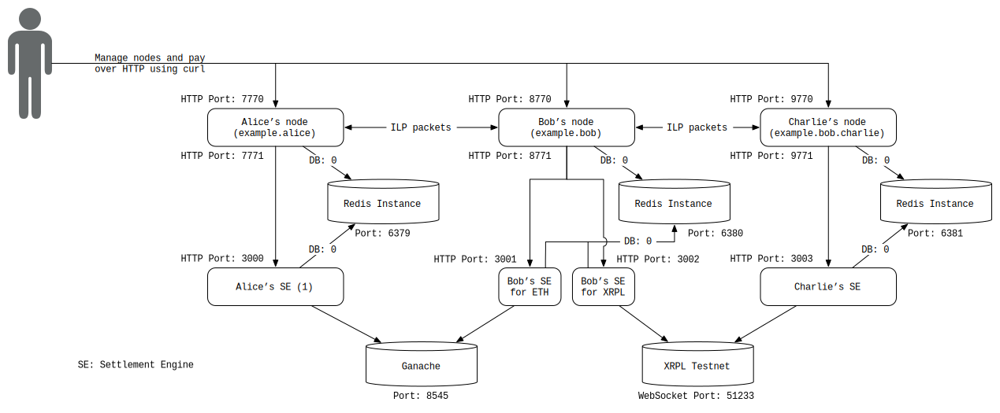

# Interledger with Ethereum and XRP On-Ledger Settlement
> A demo that sends payments between 3 Interledger.rs nodes and settles using Ethereum transactions and XRP transactions.

## Overview
This example shows how to configure Interledger.rs nodes and use an Ethereum network (testnet or mainnet) and the XRP Ledger testnet as settlement ledgers for payments sent between the nodes. If you are new to Ethereum, you can learn about it [here](https://www.ethereum.org/beginners/). You'll find many useful resources about the XRP Ledger (XRPL) [here](https://xrpl.org). To learn about settlement in Interledger, refer to [Peering, Clearing and Settling](https://github.com/interledger/rfcs/blob/master/0032-peering-clearing-settlement/0032-peering-clearing-settlement.md).



## Prerequisites

- [Rust](#rust)
- [An Ethereum network](#an-ethereum-network) to connect to
- [XRP Settlement Engine](#xrp-settlement-engine)
- [Redis](#redis)

### Rust

Because Interledger.rs is written in the Rust language, you need the Rust environment. Refer to the [Getting started](https://www.rust-lang.org/learn/get-started) page or just `curl https://sh.rustup.rs -sSf | sh` and follow the instructions.

### An Ethereum network
First, you need an Ethereum network. You can either use a local testnet, a remote testnet, or the mainnet.

For this example, we'll use [ganache-cli](https://github.com/trufflesuite/ganache-cli) which deploys a local Ethereum testnet at `localhost:8545`. To install `ganache-cli`, run `npm install -g ganache-cli`. If you do not already have Node.js installed on your computer, you can follow [the instructions below](#install-nodejs) to install it.

Advanced: You can run this against the Rinkeby Testnet by running a node that connects to Rinkeby (e.g. `geth --rinkeby --syncmode "light"`) or use a third-party node provider such as [Infura](https://infura.io/). You must also [create a wallet](https://www.myetherwallet.com/) and then obtain funds via the [Rinkeby Faucet](https://faucet.rinkeby.io/).

#### Install Node.js
(In case you don't have Node.js) There are a few ways to install Node.js. If you work on multiple JavaScript or TypeScript projects which require different `node` versions, using `nvm` may be suitable.

- [`nvm`](https://github.com/nvm-sh/nvm) (node version manager)
    - macOS: If you use [Homebrew](https://brew.sh/), run `brew install nvm` and you'll see some additional instructions. Follow it and `nvm install node` and `nvm use node`.
    - others: Refer to [`nvm`](https://github.com/nvm-sh/nvm) site.
- Install independently
    - macOS: If you use [Homebrew](https://brew.sh/), run `brew install node`
    - Ubuntu: `sudo apt-get install nodejs npm`

Then you should be able to use `npm`. To install `ganache-cli`, run `npm install -g ganache-cli`.

### XRP Settlement Engine
Because Interledger.rs and other settlement engines could wonderfully cooperate together, we'll utilize the [XRP Settlement Engine](https://github.com/interledgerjs/settlement-xrp/) which is written in TypeScript. The interface is being defined [here](https://github.com/interledger/rfcs/pull/536). We'll need `node` and `npm` to install and run the settlement engine. If you don't have it already, refer to [Install Node.js](#install-nodejs).

Install the settlement engine as follows:
```bash #
# wherever you want to install the settlement engine
git clone https://github.com/interledgerjs/settlement-xrp/
cd settlement-xrp && npm install && npm run build && npm link
```

This makes the `ilp-settlement-xrp` command available to your path.

### Redis
The Interledger.rs nodes currently use [Redis](https://redis.io/) to store their data (SQL database support coming soon!)

- Compile and install from the source code
    - [Download the source code here](https://redis.io/download)
- Install using package managers
    - Ubuntu: run `sudo apt-get install redis-server`
    - macOS: If you use Homebrew, run `brew install redis`

Make sure your Redis is empty. You could run `redis-cli flushall` to clear all the data.

## Instructions

<!--!
function error_and_exit() {
    printf "\e[31m$1\e[m\n"
    exit 1
}

printf "Stopping Interledger nodes\n"

if lsof -Pi :6379 -sTCP:LISTEN -t >/dev/null ; then
    redis-cli -p 6379 shutdown
fi

if lsof -Pi :6380 -sTCP:LISTEN -t >/dev/null ; then
    redis-cli -p 6380 shutdown
fi

if lsof -Pi :6381 -sTCP:LISTEN -t >/dev/null ; then
    redis-cli -p 6381 shutdown
fi

if [ -f dump.rdb ] ; then
    rm -f dump.rdb
fi

if lsof -tPi :8545 ; then
    kill `lsof -tPi :8545`
fi

if lsof -tPi :7770 ; then
    kill `lsof -tPi :7770`
fi

if lsof -tPi :8770 ; then
    kill `lsof -tPi :8770`
fi

if lsof -tPi :9770 ; then
    kill `lsof -tPi :9770`
fi

if lsof -tPi :3000 ; then
    kill `lsof -tPi :3000`
fi

if lsof -tPi :3001 ; then
    kill `lsof -tPi :3001`
fi

if lsof -tPi :3002 ; then
    kill `lsof -tPi :3002`
fi

if lsof -tPi :3003 ; then
    kill `lsof -tPi :3003`
fi
-->

### 1. Build interledger.rs
First of all, let's build interledger.rs. (This may take a couple of minutes)

<!--! printf "Building interledger.rs... (This may take a couple of minutes)\n" -->
```bash
cargo build --bins
```

### 2. Launch Redis

<!--!
redis-server --version &> /dev/null || error_and_exit "Uh oh! You need to install redis-server before running this example"
-->

```bash
# Create the logs directory if it doesn't already exist
mkdir -p logs

# Start Redis
redis-server --port 6379 &> logs/redis-alice.log &
redis-server --port 6380 &> logs/redis-bob.log &
redis-server --port 6381 &> logs/redis-charlie.log &
```

If you want to remove all the data in Redis, try:

```bash #
redis-cli -p 6379 flushall
redis-cli -p 6380 flushall
redis-cli -p 6381 flushall
```

When you want to watch logs, use the `tail` command. You can use the command like: `tail -f logs/redis-alice.log`

### 3. Launch Ganache

This will launch an Ethereum testnet with 10 prefunded accounts. The mnemonic is used because we want to know the keys we'll use for Alice and Bob (otherwise they are randomized).

```bash
ganache-cli -m "abstract vacuum mammal awkward pudding scene penalty purchase dinner depart evoke puzzle" -i 1 &> logs/ganache.log &
```

<!--! sleep 3 -->

### 4. Launch Settlement Engines
In this example, we'll connect 3 Interledger nodes and each node needs its own settlement engine for each settlement ledger; We'll launch 4 settlement engines in total.

1. A settlement engine for Alice to Bob on Ethereum
    - To settle the balance of Bob's account on Alice's node (Port 3000)
1. A settlement engine for Bob to Alice on Ethereum
    - To settle the balance of Alice's account on Bob's node (Port 3001)
1. A settlement engine for Bob to Charlie on XRPL
    - To settle the balance of Charlie's account on Bob's node (Port 3002)
1. A settlement engine for Charlie to Bob on XRPL
    - To settle the balance of Bob's account on Charlie's node (Port 3003)

Instead of using the LEDGER_ADDRESS and LEDGER_SECRET from the examples below, you can generate your own XRPL credentials at the [official faucet](https://xrpl.org/xrp-test-net-faucet.html).

<!--!
which ilp-settlement-xrp &> /dev/null || error_and_exit "You need to install \"ilp-settlement-xrp\"."
-->

```bash
# Turn on debug logging for all of the interledger.rs components
export RUST_LOG=interledger=debug

# Start Alice's settlement engine (ETH)
cargo run --package interledger-settlement-engines -- ethereum-ledger \
--key 380eb0f3d505f087e438eca80bc4df9a7faa24f868e69fc0440261a0fc0567dc \
--confirmations 0 \
--poll_frequency 1000 \
--ethereum_endpoint http://127.0.0.1:8545 \
--connector_url http://127.0.0.1:7771 \
--redis_uri redis://127.0.0.1:6379/0 \
--asset_scale 6 \
--watch_incoming true \
--port 3000 \
&> logs/node-alice-settlement-engine-eth.log &

# Start Bob's settlement engine (ETH, XRPL)
cargo run --package interledger-settlement-engines -- ethereum-ledger \
--key cc96601bc52293b53c4736a12af9130abf347669b3813f9ec4cafdf6991b087e \
--confirmations 0 \
--poll_frequency 1000 \
--ethereum_endpoint http://127.0.0.1:8545 \
--connector_url http://127.0.0.1:8771 \
--redis_uri redis://127.0.0.1:6380/0 \
--asset_scale 6 \
--watch_incoming true \
--port 3001 \
&> logs/node-bob-settlement-engine-eth.log &

DEBUG="xrp-settlement-engine" \
LEDGER_ADDRESS="rLna4iDTAn2vNs4CSBwhoz5HQ9M1Xm58F4" \
LEDGER_SECRET="sn22GccSrAj4B2HtQN6YTk14Qwfnt" \
CONNECTOR_URL="http://localhost:8771" \
REDIS_PORT=6380 \
ENGINE_PORT=3002 \
ilp-settlement-xrp \
&> logs/node-bob-settlement-engine-xrpl.log &

# Start Charlie's settlement engine (XRPL)
DEBUG="xrp-settlement-engine" \
LEDGER_ADDRESS="r3FugEA5WpL4q3hmkUfo8a3pjdb214wsth" \
LEDGER_SECRET="shRjP3WyN7TLsEAbw5hns4bNGZvRY" \
CONNECTOR_URL="http://localhost:9771" \
REDIS_PORT=6381 \
ENGINE_PORT=3003 \
ilp-settlement-xrp \
&> logs/node-charlie-settlement-engine-xrpl.log &
```

### 5. Launch 3 Nodes

```bash
# Start Alice's node
ILP_ADDRESS=example.alice \
ILP_SECRET_SEED=8852500887504328225458511465394229327394647958135038836332350604 \
ILP_ADMIN_AUTH_TOKEN=hi_alice \
ILP_REDIS_CONNECTION=redis://127.0.0.1:6379/0 \
ILP_HTTP_ADDRESS=127.0.0.1:7770 \
ILP_BTP_ADDRESS=127.0.0.1:7768 \
ILP_SETTLEMENT_ADDRESS=127.0.0.1:7771 \
ILP_DEFAULT_SPSP_ACCOUNT=0 \
cargo run --package interledger -- node &> logs/node-alice.log &

# Start Bob's node
ILP_ADDRESS=example.bob \
ILP_SECRET_SEED=1604966725982139900555208458637022875563691455429373719368053354 \
ILP_ADMIN_AUTH_TOKEN=hi_bob \
ILP_REDIS_CONNECTION=redis://127.0.0.1:6380/0 \
ILP_HTTP_ADDRESS=127.0.0.1:8770 \
ILP_BTP_ADDRESS=127.0.0.1:8768 \
ILP_SETTLEMENT_ADDRESS=127.0.0.1:8771 \
ILP_DEFAULT_SPSP_ACCOUNT=0 \
cargo run --package interledger -- node &> logs/node-bob.log &

# Start Charlie's node
ILP_ADDRESS=example.bob.charlie \
ILP_SECRET_SEED=1232362131122139900555208458637022875563691455429373719368053354 \
ILP_ADMIN_AUTH_TOKEN=hi_charlie \
ILP_REDIS_CONNECTION=redis://127.0.0.1:6381/0 \
ILP_HTTP_ADDRESS=127.0.0.1:9770 \
ILP_BTP_ADDRESS=127.0.0.1:9768 \
ILP_SETTLEMENT_ADDRESS=127.0.0.1:9771 \
ILP_DEFAULT_SPSP_ACCOUNT=0 \
cargo run --package interledger -- node &> logs/node-charlie.log &
```

<!--!
printf "Waiting for nodes to start up...\n"

function wait_to_serve() {
    while :
    do
        printf "."
        sleep 1
        curl $1 &> /dev/null
        if [ $? -eq 0 ]; then
            break;
        fi
    done
}

wait_to_serve "http://localhost:7770"
wait_to_serve "http://localhost:8770"
wait_to_serve "http://localhost:9770"
wait_to_serve "http://localhost:3000"
wait_to_serve "http://localhost:3001"
wait_to_serve "http://localhost:3002"
wait_to_serve "http://localhost:3003"
printf "\n"
-->

### 6. Configure the Nodes

<!--! printf "Creating accounts:\n" -->

```bash
# Adding settlement accounts should be done at the same time because it checks each other

printf "Adding Alice's account...\n"
curl \
    -H "Content-Type: application/json" \
    -H "Authorization: Bearer hi_alice" \
    -d '{
    "username" : "alice",
    "ilp_address": "example.alice",
    "asset_code": "ETH",
    "asset_scale": 6,
    "max_packet_amount": 100,
    "http_incoming_token": "alice_password",
    "http_endpoint": "http://localhost:7770/ilp",
    "settle_to" : 0}' \
    http://localhost:7770/accounts > logs/account-alice-alice.log 2>/dev/null

printf "Adding Charlie's Account...\n"
curl \
    -H "Content-Type: application/json" \
    -H "Authorization: Bearer hi_charlie" \
    -d '{
    "ilp_address": "example.bob.charlie",
    "username" : "charlie",
    "asset_code": "XRP",
    "asset_scale": 6,
    "max_packet_amount": 100,
    "http_incoming_token": "charlie_password",
    "http_endpoint": "http://localhost:9770/ilp",
    "settle_to" : 0}' \
    http://localhost:9770/accounts > logs/account-charlie-charlie.log 2>/dev/null

printf "Adding Bob's account on Alice's node (ETH Peer relation)...\n"
curl \
    -H "Content-Type: application/json" \
    -H "Authorization: Bearer hi_alice" \
    -d '{
    "ilp_address": "example.bob",
    "username" : "bob",
    "asset_code": "ETH",
    "asset_scale": 6,
    "max_packet_amount": 100,
    "settlement_engine_url": "http://localhost:3000",
    "http_incoming_token": "bob_password",
    "http_outgoing_token": "alice:alice_password",
    "http_endpoint": "http://localhost:8770/ilp",
    "settle_threshold": 500,
    "min_balance": -1000,
    "settle_to" : 0,
    "routing_relation": "Peer",
    "send_routes": true,
    "receive_routes": true}' \
    http://localhost:7770/accounts > logs/account-alice-bob.log 2>/dev/null

printf "Adding Alice's account on Bob's node (ETH Peer relation)...\n"
curl \
    -H "Content-Type: application/json" \
    -H "Authorization: Bearer hi_bob" \
    -d '{
    "ilp_address": "example.alice",
    "username": "alice",
    "asset_code": "ETH",
    "asset_scale": 6,
    "max_packet_amount": 100,
    "settlement_engine_url": "http://localhost:3001",
    "http_incoming_token": "alice_password",
    "http_outgoing_token": "bob:bob_password",
    "http_endpoint": "http://localhost:7770/ilp",
    "settle_threshold": 500,
    "min_balance": -1000,
    "settle_to" : 0,
    "routing_relation": "Peer",
    "send_routes": true,
    "receive_routes": true}' \
    http://localhost:8770/accounts > logs/account-bob-alice.log 2>/dev/null

printf "Adding Charlie's account on Bob's node (XRP Child relation)...\n"
curl \
    -H "Content-Type: application/json" \
    -H "Authorization: Bearer hi_bob" \
    -d '{
    "ilp_address": "example.bob.charlie",
    "username" : "charlie",
    "asset_code": "XRP",
    "asset_scale": 6,
    "max_packet_amount": 100,
    "settlement_engine_url": "http://localhost:3002",
    "http_incoming_token": "charlie_password",
    "http_outgoing_token": "bob:bob_other_password",
    "http_endpoint": "http://localhost:9770/ilp",
    "settle_threshold": 500,
    "min_balance": -1000,
    "settle_to" : 0,
    "routing_relation": "Child",
    "send_routes": false,
    "receive_routes": true}' \
    http://localhost:8770/accounts > logs/account-bob-charlie.log 2>/dev/null

printf "Adding Bob's account on Charlie's node (XRP Parent relation)...\n"
curl \
    -H "Content-Type: application/json" \
    -H "Authorization: Bearer hi_charlie" \
    -d '{
    "ilp_address": "example.bob",
    "username" : "bob",
    "asset_code": "XRP",
    "asset_scale": 6,
    "max_packet_amount": 100,
    "settlement_engine_url": "http://localhost:3003",
    "http_incoming_token": "bob_other_password",
    "http_outgoing_token": "charlie:charlie_password",
    "http_endpoint": "http://localhost:8770/ilp",
    "settle_threshold": 500,
    "min_balance": -1000,
    "settle_to" : 0,
    "routing_relation": "Parent",
    "send_routes": false,
    "receive_routes": true}' \
    http://localhost:9770/accounts > logs/account-charlie-bob.log 2>/dev/null

sleep 2
```

Now three nodes and its settlement engines are set and accounts for each node are also set up.

Notice how we use Alice's settlement engine endpoint while registering Bob. This means that whenever Alice interacts with Bob's account, she'll use that Settlement Engine. This could be also said for the other accounts on the other nodes.

The `settle_threshold` and `settle_to` parameters control when settlements are triggered. The node will send a settlement when an account's balance reaches the `settle_threshold`, and it will settle for `balance - settle_to`.

### 7. Set the exchange rate between ETH and XRP on Bob's connector

```bash
printf "\nSetting the exchange rate...\n"
curl http://localhost:8770/rates -X PUT \
    -H "Content-Type: application/json" \
    -H "Authorization: Bearer hi_bob" \
    -d "{ \"ETH\" : 1, \"XRP\": 1 }" \
    &>/dev/null
```

### 8. Sending a Payment

<!--!
printf "\nChecking balances...\n"

printf "\nAlice's balance on Alice's node: "
curl \
-H "Authorization: Bearer hi_alice" \
http://localhost:7770/accounts/alice/balance

printf "\nBob's balance on Alice's node: "
curl \
-H "Authorization: Bearer hi_alice" \
http://localhost:7770/accounts/bob/balance

printf "\nAlice's balance on Bob's node: "
curl \
-H "Authorization: Bearer hi_bob" \
http://localhost:8770/accounts/alice/balance

printf "\nCharlie's balance on Bob's node: "
curl \
-H "Authorization: Bearer hi_bob" \
http://localhost:8770/accounts/charlie/balance

printf "\nBob's balance on Charlie's node: "
curl \
-H "Authorization: Bearer hi_charlie" \
http://localhost:9770/accounts/bob/balance

printf "\nCharlie's balance on Charlie's node: "
curl \
-H "Authorization: Bearer hi_charlie" \
http://localhost:9770/accounts/charlie/balance

printf "\n\n"
-->

The following script sends a payment from Alice to Charlie through Bob.

<!--! printf "Sending payment of 500 from Alice to Charlie through Bob\n" -->

```bash
curl \
    -H "Authorization: Bearer alice:alice_password" \
    -H "Content-Type: application/json" \
    -d "{\"receiver\":\"http://localhost:9770/spsp/charlie\",\"source_amount\":500}" \
    http://localhost:7770/pay
```

<!--! printf "\n" -->

### 8. Check Balances

You may see unsettled balances before the settlement engines exactly work. Wait a few seconds and try later.

```bash #
printf "\nAlice's balance on Alice's node: "
curl \
-H "Authorization: Bearer hi_alice" \
http://localhost:7770/accounts/alice/balance

printf "\nBob's balance on Alice's node: "
curl \
-H "Authorization: Bearer hi_alice" \
http://localhost:7770/accounts/bob/balance

printf "\nAlice's balance on Bob's node: "
curl \
-H "Authorization: Bearer hi_bob" \
http://localhost:8770/accounts/alice/balance

printf "\nCharlie's balance on Bob's node: "
curl \
-H "Authorization: Bearer hi_bob" \
http://localhost:8770/accounts/charlie/balance

printf "\nBob's balance on Charlie's node: "
curl \
-H "Authorization: Bearer hi_charlie" \
http://localhost:9770/accounts/bob/balance

printf "\nCharlie's balance on Charlie's node: "
curl \
-H "Authorization: Bearer hi_charlie" \
http://localhost:9770/accounts/charlie/balance
```

<!--!
INCOMING_NOT_SETTLED=0
printf "\nChecking balances...\n"

printf "\nAlice's balance on Alice's node: "
curl \
-H "Authorization: Bearer hi_alice" \
http://localhost:7770/accounts/alice/balance

printf "\nBob's balance on Alice's node: "
curl \
-H "Authorization: Bearer hi_alice" \
http://localhost:7770/accounts/bob/balance

printf "\nAlice's balance on Bob's node: "
AB_BALANCE=`curl \
-H "Authorization: Bearer hi_bob" \
http://localhost:8770/accounts/alice/balance 2>/dev/null`
EXPECTED_BALANCE='{"balance":"-500"}'
if [[ $AB_BALANCE != $EXPECTED_BALANCE ]]; then
    INCOMING_NOT_SETTLED=1
    printf "\e[33m$AB_BALANCE\e[m"
else
    printf $AB_BALANCE
fi

printf "\nCharlie's balance on Bob's node: "
curl \
-H "Authorization: Bearer hi_bob" \
http://localhost:8770/accounts/charlie/balance

printf "\nBob's balance on Charlie's node: "
BC_BALANCE=`curl \
-H "Authorization: Bearer hi_charlie" \
http://localhost:9770/accounts/bob/balance 2>/dev/null`
EXPECTED_BALANCE='{"balance":"-500"}'
if [[ $BC_BALANCE != $EXPECTED_BALANCE ]]; then
    INCOMING_NOT_SETTLED=1
    printf "\e[33m$BC_BALANCE\e[m"
else
    printf $BC_BALANCE
fi

printf "\nCharlie's balance on Charlie's node: "
curl \
-H "Authorization: Bearer hi_charlie" \
http://localhost:9770/accounts/charlie/balance

printf "\n"

if [ $INCOMING_NOT_SETTLED -eq 1 ]; then
    printf "\n\e[33mThis means the incoming settlement is not done yet. It will be done once the block is generated or a ledger is validated.\n"
    printf "Try the following commands later:\n\n"
    printf "\tcurl -H \"Authorization: Bearer hi_bob\" http://localhost:8770/accounts/alice/balance\n"
    printf "\tcurl -H \"Authorization: Bearer hi_charlie\" http://localhost:9770/accounts/bob/balance\e[m\n"
fi
-->

### 9. Kill All the Services
Finally, you can stop all the services as follows:

```bash #
if lsof -Pi :6379 -sTCP:LISTEN -t >/dev/null ; then
    redis-cli -p 6379 shutdown
fi

if lsof -Pi :6380 -sTCP:LISTEN -t >/dev/null ; then
    redis-cli -p 6380 shutdown
fi

if lsof -Pi :6381 -sTCP:LISTEN -t >/dev/null ; then
    redis-cli -p 6381 shutdown
fi

if [ -f dump.rdb ] ; then
    rm -f dump.rdb
fi

if lsof -tPi :8545 ; then
    kill `lsof -tPi :8545`
fi

if lsof -tPi :7770 ; then
    kill `lsof -tPi :7770`
fi

if lsof -tPi :8770 ; then
    kill `lsof -tPi :8770`
fi

if lsof -tPi :9770 ; then
    kill `lsof -tPi :9770`
fi

if lsof -tPi :3000 ; then
    kill `lsof -tPi :3000`
fi

if lsof -tPi :3001 ; then
    kill `lsof -tPi :3001`
fi

if lsof -tPi :3002 ; then
    kill `lsof -tPi :3002`
fi

if lsof -tPi :3003 ; then
    kill `lsof -tPi :3003`
fi
```

## Advanced

### Check the Settlement Block Generation
To check whether the settlement block is generated, we use `geth`. `geth` is the abbreviation of `go-ethereum` which is an Ethereum client written in the go language. If you don't already have `geth`, refer to the following.

- Compile and install from the source code
    - Refer to [Building Ethereum](https://github.com/ethereum/go-ethereum/wiki/Building-Ethereum) page.
- Install using package managers
    - Ubuntu: Follow the instructions [here](https://github.com/ethereum/go-ethereum/wiki/Installation-Instructions-for-Ubuntu).
    - macOS: If you use Homebrew, run `brew tap ethereum/ethereum` and `brew install ethereum`. Details are found [here](https://github.com/ethereum/go-ethereum/wiki/Installation-Instructions-for-Mac).
    - others: Refer to [Building Ethereum](https://github.com/ethereum/go-ethereum/wiki/Building-Ethereum) page.

Then dump transaction logs as follows. You will see generated block information. Be aware that ganache takes 10 to 20 seconds to generate a block. So you will have to wait for it before you check with `geth`.

<!-- # below means preventing output through run-md.sh -->
```bash #
printf "Last block: "
geth --exec "eth.getTransaction(eth.getBlock(eth.blockNumber-1).transactions[0])" attach http://localhost:8545 2>/dev/null
printf "\nCurrent block: "
geth --exec "eth.getTransaction(eth.getBlock(eth.blockNumber).transactions[0])" attach http://localhost:8545 2>/dev/null
```

If you inspect `ganache-cli`'s output, you will notice that the block number has increased as a result of the settlement executions as well.

### Check the Incoming Settlement on XRPL
You'll find incoming settlement logs in your settlement engine logs. Try:

```bash #
cat logs/node-charlie-settlement-engine-xrpl.log | grep "Got incoming XRP payment"
```

<!--!
printf "\nYou could try the following command to check if a block is generated.\nTo check, you'll need to install geth.\n\n"
printf "To check the last block:\n"
printf "\tgeth --exec \"eth.getTransaction(eth.getBlock(eth.blockNumber-1).transactions[0])\" attach http://localhost:8545 2>/dev/null\n\n"
printf "To check the current block:\n"
printf "\tgeth --exec \"eth.getTransaction(eth.getBlock(eth.blockNumber).transactions[0])\" attach http://localhost:8545 2>/dev/null\n\n"
printf "You could also try the following command to check if XRPL incoming payment is done.\n\n"
printf "\tcat logs/node-charlie-settlement-engine-xrpl.log | grep \"Got incoming XRP payment\"\n\n"
-->

## Troubleshooting

```
# When installing ganache-cli
gyp ERR! find Python Python is not set from command line or npm configuration
gyp ERR! find Python Python is not set from environment variable PYTHON
gyp ERR! find Python checking if "python" can be used
gyp ERR! find Python - executable path is "/Users/xxxx/anaconda3/bin/python"
gyp ERR! find Python - version is "3.6.2"
gyp ERR! find Python - version is 3.6.2 - should be >=2.6.0 <3.0.0
gyp ERR! find Python - THIS VERSION OF PYTHON IS NOT SUPPORTED
gyp ERR! find Python checking if "python2" can be used
gyp ERR! find Python - "python2" is not in PATH or produced an error
```

If you see an error like the above, you have to install Python 2.7.

```
# When installing Node.js with apt-get
E: Unable to locate package nodejs
E: Unable to locate package npm
```

Try `sudo apt-get update`.

```
# When you try run-md.sh
Fatal: Failed to start the JavaScript console: api modules: Post http://localhost:8545: context deadline exceeded
```

It seems that you failed to install `ganache-cli`. Try to install it.

## Conclusion

This example showed an SPSP payment sent between three Interledger.rs nodes that settled using on-ledger Ethereum and XRPL transactions.

More examples that enhance your integration with ILP are coming soon!
