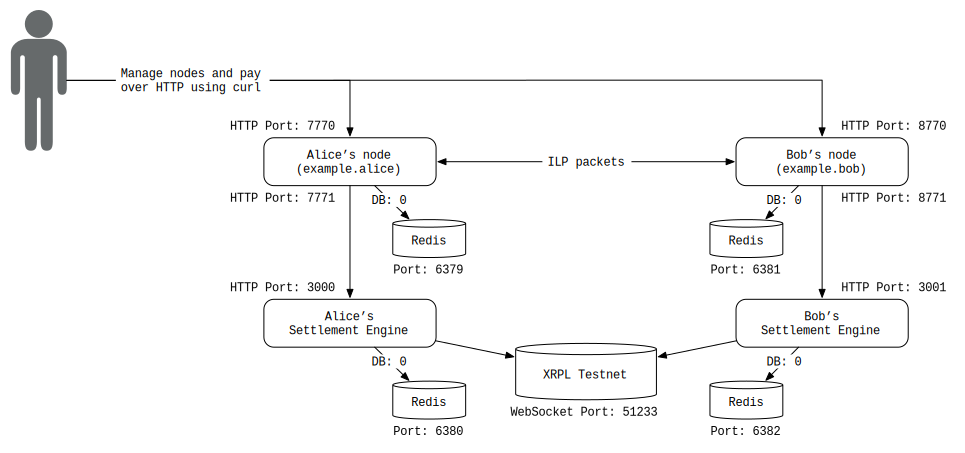

# Interledger with XRP On-Ledger Settlement

> A demo that sends payments between 2 Interledger.rs nodes and settles using XRP transactions.

## Overview

This example shows how to configure Interledger.rs nodes and use the XRP testnet as a settlement ledger for payments sent between the nodes. You'll find many useful resources about the XRP Ledger (XRPL) [here](https://xrpl.org). To learn about settlement in Interledger, refer to [Peering, Clearing and Settling](https://github.com/interledger/rfcs/blob/master/0032-peering-clearing-settlement/0032-peering-clearing-settlement.md).



## Prerequisites

- [Rust](#rust)
- [XRP Settlement Engine](#xrp-settlement-engine)
- [Redis](#redis)

### Rust

Because Interledger.rs is written in the Rust language, you need the Rust environment. Refer to the [Getting started](https://www.rust-lang.org/learn/get-started) page or just `curl https://sh.rustup.rs -sSf | sh` and follow the instructions.

### XRP Settlement Engine

Interledger.rs and settlement engines written in other languages are fully interoperable. Here, we'll use the [XRP Ledger Settlement Engine](https://github.com/interledgerjs/settlement-xrp/), which is written in TypeScript. We'll need `node` and `npm` to install and run the settlement engine. If you don't have it already, refer to [Install Node.js](#install-nodejs).

Install the settlement engine as follows:

```bash
npm i -g ilp-settlement-xrp
```

(This makes the `ilp-settlement-xrp` command available to your PATH.)

#### Install Node.js

(In case you don't have Node.js) There are a few ways to install Node.js. If you work on multiple JavaScript or TypeScript projects which require different `node` versions, using `nvm` may be suitable.

- [`nvm`](https://github.com/nvm-sh/nvm) (node version manager)
  - macOS: If you use [Homebrew](https://brew.sh/), run `brew install nvm` and you'll see some additional instructions. Follow it and `nvm install node` and `nvm use node`.
  - others: Refer to [`nvm`](https://github.com/nvm-sh/nvm) site.
- Install independently
  - macOS: If you use [Homebrew](https://brew.sh/), run `brew install node`
  - Ubuntu: `sudo apt-get install nodejs npm`

Then you should be able to use `npm`.

### Redis

The Interledger.rs nodes and settlement engines currently use [Redis](https://redis.io/) to store their data (SQL database support coming soon!). Nodes and settlement engines can use different Redis instances.

- Compile and install from the source code
  - [Download the source code here](https://redis.io/download)
- Install using package managers
  - Ubuntu: run `sudo apt-get install redis-server`
  - macOS: If you use Homebrew, run `brew install redis`

Make sure your Redis is empty. You could run `redis-cli flushall` to clear all the data.

## Instructions

<!--!
# import some functions from run-md-lib.sh
# this variable is set by run-md.sh
source $RUN_MD_LIB
init

printf "Stopping Interledger nodes...\n"

if [ "$USE_DOCKER" -eq 1 ]; then
    $CMD_DOCKER --version > /dev/null || error_and_exit "Uh oh! You need to install Docker before running this example"
    mkdir -p logs

    $CMD_DOCKER stop \
        interledger-rs-node_a \
        interledger-rs-node_b \
        interledger-rs-se_a \
        interledger-rs-se_b \
        redis-alice_node \
        redis-alice_se \
        redis-bob_node \
        redis-bob_se 2>/dev/null

    printf "\n\nRemoving existing Interledger containers\n"
    $CMD_DOCKER rm \
        interledger-rs-node_a \
        interledger-rs-node_b \
        interledger-rs-se_a \
        interledger-rs-se_b \
        redis-alice_node \
        redis-alice_se \
        redis-bob_node \
        redis-bob_se 2>/dev/null
else
    for port in `seq 6379 6382`; do
        if lsof -Pi :${port} -sTCP:LISTEN -t ; then
            redis-cli -p ${port} shutdown
        fi
    done

    if [ -f dump.rdb ] ; then
        rm -f dump.rdb
    fi

    for port in 8545 7770 8770 3000 3001; do
        if lsof -tPi :${port} ; then
            kill `lsof -tPi :${port}`
        fi
    done
fi

# Aliases don't play nicely with scripts, so this is our faux-alias
function ilp-cli {
    cargo run --quiet --bin ilp-cli -- $@
}

-->

### 1. Build interledger.rs

First of all, let's build interledger.rs. (This may take a couple of minutes)

<!--!
if [ "$USE_DOCKER" -eq 1 ]; then
    NETWORK_ID=`$CMD_DOCKER network ls -f "name=interledger" --format="{{.ID}}"`
    if [ -z "${NETWORK_ID}" ]; then
        printf "Creating a docker network...\n"
        $CMD_DOCKER network create interledger
    fi
else
    printf "\nBuilding interledger.rs... (This may take a couple of minutes)\n\n"
-->

```bash
cargo build --bin ilp-node --bin ilp-cli
```

<!--!
fi
-->

### 2. Launch Redis

<!--!
printf "\n\nStarting Redis instances...\n\n"
if [ "$USE_DOCKER" -eq 1 ]; then
    $CMD_DOCKER run --name redis-alice_node -d -p 127.0.0.1:6379:6379 --network=interledger redis:5.0.5
    $CMD_DOCKER run --name redis-alice_se -d -p 127.0.0.1:6380:6379 --network=interledger redis:5.0.5
    $CMD_DOCKER run --name redis-bob_node -d -p 127.0.0.1:6381:6379 --network=interledger redis:5.0.5
    $CMD_DOCKER run --name redis-bob_se -d -p 127.0.0.1:6382:6379 --network=interledger redis:5.0.5
else
    redis-server --version > /dev/null || error_and_exit "Uh oh! You need to install redis-server before running this example"
-->

```bash
# Create the logs directory if it doesn't already exist
mkdir -p logs

# Start Redis
redis-server --port 6379 &> logs/redis-a-node.log &
redis-server --port 6380 &> logs/redis-a-se.log &
redis-server --port 6381 &> logs/redis-b-node.log &
redis-server --port 6382 &> logs/redis-b-se.log &
```

<!--!
sleep 1
-->

To remove all the data in Redis, you might additionally perform:

```bash
for port in `seq 6379 6382`; do
    redis-cli -p $port flushall
done
```

<!--!
fi
-->

When you want to watch logs, use the `tail` command. You can use the command like: `tail -f logs/redis-a-node.log`

### 3. Launch Settlement Engines

Because each node needs its own settlement engine, we need to launch both a settlement engine for Alice's node and another settlement engine for Bob's node.

By default, the XRP settlement engine generates new testnet XRPL accounts prefunded with 1,000 testnet XRP (a new account is generated each run). Alternatively, you may supply an `XRP_SECRET` environment variable by generating your own testnet credentials from the [official faucet](https://xrpl.org/xrp-test-net-faucet.html).

<!--!
printf "\nStarting settlement engines...\n"
if [ "$USE_DOCKER" -eq 1 ]; then
    # Start Alice's settlement engine
    $CMD_DOCKER run \
        -p 127.0.0.1:3000:3000 \
        --network=interledger \
        --name=interledger-rs-se_a \
        -id \
        -e DEBUG=settlement* \
        -e CONNECTOR_URL=http://interledger-rs-node_a:7771 \
        -e REDIS_URI=redis-alice_se \
        interledgerjs/settlement-xrp

    # Start Bob's settlement engine
    $CMD_DOCKER run \
        -p 127.0.0.1:3001:3000 \
        --network=interledger \
        --name=interledger-rs-se_b \
        -id \
        -e DEBUG=settlement* \
        -e CONNECTOR_URL=http://interledger-rs-node_b:7771 \
        -e REDIS_URI=redis-bob_se \
        interledgerjs/settlement-xrp
else
-->

```bash
# Turn on debug logging for all of the interledger.rs components
export RUST_LOG=interledger=debug

# Start Alice's settlement engine
DEBUG="settlement*" \
REDIS_URI=127.0.0.1:6380 \
ilp-settlement-xrp \
&> logs/node-alice-settlement-engine.log &

# Start Bob's settlement engine
DEBUG="settlement*" \
CONNECTOR_URL="http://localhost:8771" \
REDIS_URI=127.0.0.1:6382 \
ENGINE_PORT=3001 \
ilp-settlement-xrp \
&> logs/node-bob-settlement-engine.log &
```

<!--!
fi
-->

### 4. Launch 2 Nodes

<!--!
printf "\n\nStarting Interledger nodes...\n"
if [ "$USE_DOCKER" -eq 1 ]; then
    # Start Alice's node
    $CMD_DOCKER run \
        -e ILP_ADDRESS=example.alice \
        -e ILP_SECRET_SEED=8852500887504328225458511465394229327394647958135038836332350604 \
        -e ILP_ADMIN_AUTH_TOKEN=hi_alice \
        -e ILP_REDIS_URL=redis://redis-alice_node:6379/ \
        -e ILP_HTTP_BIND_ADDRESS=0.0.0.0:7770 \
        -e ILP_SETTLEMENT_API_BIND_ADDRESS=0.0.0.0:7771 \
        -p 127.0.0.1:7770:7770 \
        -p 127.0.0.1:7771:7771 \
        --network=interledger \
        --name=interledger-rs-node_a \
        -td \
        interledgerrs/node

    # Start Bob's node
    $CMD_DOCKER run \
        -e ILP_ADDRESS=example.bob \
        -e ILP_SECRET_SEED=1604966725982139900555208458637022875563691455429373719368053354 \
        -e ILP_ADMIN_AUTH_TOKEN=hi_bob \
        -e ILP_REDIS_URL=redis://redis-bob_node:6379/ \
        -e ILP_HTTP_BIND_ADDRESS=0.0.0.0:7770 \
        -e ILP_SETTLEMENT_API_BIND_ADDRESS=0.0.0.0:7771 \
        -p 127.0.0.1:8770:7770 \
        -p 127.0.0.1:8771:7771 \
        --network=interledger \
        --name=interledger-rs-node_b \
        -td \
        interledgerrs/node
else
-->

```bash
# Start Alice's node
ILP_ADDRESS=example.alice \
ILP_SECRET_SEED=8852500887504328225458511465394229327394647958135038836332350604 \
ILP_ADMIN_AUTH_TOKEN=hi_alice \
ILP_REDIS_URL=redis://127.0.0.1:6379/ \
ILP_HTTP_BIND_ADDRESS=127.0.0.1:7770 \
ILP_SETTLEMENT_API_BIND_ADDRESS=127.0.0.1:7771 \
cargo run --bin ilp-node &> logs/node-alice.log &

# Start Bob's node
ILP_ADDRESS=example.bob \
ILP_SECRET_SEED=1604966725982139900555208458637022875563691455429373719368053354 \
ILP_ADMIN_AUTH_TOKEN=hi_bob \
ILP_REDIS_URL=redis://127.0.0.1:6381/ \
ILP_HTTP_BIND_ADDRESS=127.0.0.1:8770 \
ILP_SETTLEMENT_API_BIND_ADDRESS=127.0.0.1:8771 \
cargo run --bin ilp-node &> logs/node-bob.log &
```

<!--!
fi

printf "\nWaiting for Interledger.rs nodes to start up"

wait_to_serve "http://localhost:7770" 10 || error_and_exit "\nFailed to spin up nodes. Check out your configuration and log files."
wait_to_serve "http://localhost:8770" 10 || error_and_exit "\nFailed to spin up nodes. Check out your configuration and log files."
wait_to_serve "http://localhost:3000" 10 || error_and_exit "\nFailed to spin up nodes. Check out your configuration and log files."
wait_to_serve "http://localhost:3001" 10 || error_and_exit "\nFailed to spin up nodes. Check out your configuration and log files."

printf " done\nThe Interledger.rs nodes are up and running!\n\n"
-->

### 5. Configure the Nodes

<!--!
printf "Creating accounts:\n"
if [ "$USE_DOCKER" -eq 1 ]; then
    # Adding settlement accounts should be done at the same time because it checks each other

    printf "Adding Alice's account...\n"
    curl \
        -H "Content-Type: application/json" \
        -H "Authorization: Bearer hi_alice" \
        -d '{
        "username": "alice",
        "ilp_address": "example.alice",
        "asset_code": "XRP",
        "asset_scale": 6,
        "max_packet_amount": 100,
        "ilp_over_http_incoming_token": "in_alice",
        "ilp_over_http_url": "http://interledger-rs-node_a:7770/ilp",
        "settle_to" : 0}' \
        http://localhost:7770/accounts > logs/account-alice-alice.log 2>/dev/null

    printf "Adding Bob's Account...\n"
    curl \
        -H "Content-Type: application/json" \
        -H "Authorization: Bearer hi_bob" \
        -d '{
        "username": "bob",
        "ilp_address": "example.bob",
        "asset_code": "XRP",
        "asset_scale": 6,
        "max_packet_amount": 100,
        "ilp_over_http_incoming_token": "in_bob",
        "ilp_over_http_url": "http://interledger-rs-node_b:7770/ilp",
        "settle_to" : 0}' \
        http://localhost:8770/accounts > logs/account-bob-bob.log 2>/dev/null

    printf "Adding Bob's account on Alice's node...\n"
    curl \
        -H "Content-Type: application/json" \
        -H "Authorization: Bearer hi_alice" \
        -d '{
        "ilp_address": "example.bob",
        "username": "bob",
        "asset_code": "XRP",
        "asset_scale": 6,
        "max_packet_amount": 100,
        "settlement_engine_url": "http://interledger-rs-se_a:3000",
        "ilp_over_http_incoming_token": "bob_password",
        "ilp_over_http_outgoing_token": "alice:alice_password",
        "ilp_over_http_url": "http://interledger-rs-node_b:7770/ilp",
        "settle_threshold": 500,
        "min_balance": -1000,
        "settle_to" : 0,
        "routing_relation": "Peer"}' \
        http://localhost:7770/accounts > logs/account-alice-bob.log 2>/dev/null &

    printf "Adding Alice's account on Bob's node...\n"
    curl \
        -H "Content-Type: application/json" \
        -H "Authorization: Bearer hi_bob" \
        -d '{
        "ilp_address": "example.alice",
        "username": "alice",
        "asset_code": "XRP",
        "asset_scale": 6,
        "max_packet_amount": 100,
        "settlement_engine_url": "http://interledger-rs-se_b:3000",
        "ilp_over_http_incoming_token": "alice_password",
        "ilp_over_http_outgoing_token": "bob:bob_password",
        "ilp_over_http_url": "http://interledger-rs-node_a:7770/ilp",
        "settle_threshold": 500,
        "min_balance": -1000,
        "settle_to" : 0,
        "routing_relation": "Peer"}' \
        http://localhost:8770/accounts > logs/account-bob-alice.log 2>/dev/null &

    sleep 2
else
-->

```bash
# This alias makes our CLI invocations more natural
alias ilp-cli="cargo run --quiet --bin ilp-cli --"

export ILP_CLI_API_AUTH=hi_alice

# Adding settlement accounts should be done at the same time because it checks each other

printf "Adding Alice's account...\n"
ilp-cli accounts create alice \
    --ilp-address example.alice \
    --asset-code XRP \
    --asset-scale 6 \
    --max-packet-amount 100 \
    --ilp-over-http-incoming-token in_alice \
    --ilp-over-http-url http://localhost:7770/ilp \
    --settle-to 0 > logs/account-alice-alice.log

printf "Adding Bob's Account...\n"
ilp-cli --node http://localhost:8770 accounts create bob \
    --auth hi_bob \
    --ilp-address example.bob \
    --asset-code XRP \
    --asset-scale 6 \
    --max-packet-amount 100 \
    --ilp-over-http-incoming-token in_bob \
    --ilp-over-http-url http://localhost:8770/ilp \
    --settle-to 0 > logs/account-bob-bob.log

printf "Adding Bob's account on Alice's node...\n"
ilp-cli accounts create bob \
    --ilp-address example.bob \
    --asset-code XRP \
    --asset-scale 6 \
    --max-packet-amount 100 \
    --settlement-engine-url http://localhost:3000 \
    --ilp-over-http-incoming-token bob_password \
    --ilp-over-http-outgoing-token alice:alice_password \
    --ilp-over-http-url http://localhost:8770/ilp \
    --settle-threshold 500 \
    --min-balance -1000 \
    --settle-to 0 \
    --routing-relation Peer > logs/account-alice-bob.log &

printf "Adding Alice's account on Bob's node...\n"
ilp-cli --node http://localhost:8770 accounts create alice \
    --auth hi_bob \
    --ilp-address example.alice \
    --asset-code XRP \
    --asset-scale 6 \
    --max-packet-amount 100 \
    --settlement-engine-url http://localhost:3001 \
    --ilp-over-http-incoming-token alice_password \
    --ilp-over-http-outgoing-token bob:bob_password \
    --ilp-over-http-url http://localhost:7770/ilp \
    --settle-threshold 500 \
    --min-balance -1000 \
    --settle-to 0 \
    --routing-relation Peer > logs/account-bob-alice.log &

sleep 2
```

<!--!
fi
-->

Now two nodes and its settlement engines are set and accounts for each node are also set up.

Notice how we use Alice's settlement engine endpoint while registering Bob. This means that whenever Alice interacts with Bob's account, she'll use that Settlement Engine.

The `settle_threshold` and `settle_to` parameters control when settlements are triggered. The node will send a settlement when an account's balance reaches the `settle_threshold`, and it will settle for `balance - settle_to`.

### 6. Sending a Payment

<!--!
printf "\n\nChecking balances prior to payment...\n"

printf "\nAlice's balance on Alice's node: "
ilp-cli accounts balance alice

printf "\nBob's balance on Alice's node: "
ilp-cli accounts balance bob

printf "\nAlice's balance on Bob's node: "
ilp-cli --node http://localhost:8770 accounts balance alice --auth hi_bob 

printf "\nBob's balance on Bob's node: "
ilp-cli --node http://localhost:8770 accounts balance bob --auth hi_bob 

printf "\n\n"
-->

The following script sends a payment from Alice to Bob.

<!--!
printf "Sending payment of 500 from Alice to Bob\n"

if [ "$USE_DOCKER" -eq 1 ]; then
    curl \
        -H "Authorization: Bearer alice:in_alice" \
        -H "Content-Type: application/json" \
        -d "{\"receiver\":\"http://interledger-rs-node_b:7770/accounts/bob/spsp\",\"source_amount\":500}" \
        http://localhost:7770/accounts/alice/payments
else
-->

```bash
ilp-cli pay alice \
    --auth in_alice \
    --amount 500 \
    --to http://localhost:8770/accounts/bob/spsp
```

<!--!
fi

printf "\n"

# wait untill the settlement is done
printf "\nWaiting for XRP ledger to be validated"
wait_to_get_http_response_body '{"balance":"0"}' 10 -H "Authorization: Bearer alice:alice_password" "http://localhost:8770/accounts/alice/balance"
printf "done\n"
-->

### 7. Check Balances

<!--!
printf "Checking balances after payment...\n"
-->

```bash
printf "\nAlice's balance on Alice's node: "
ilp-cli accounts balance alice

printf "\nBob's balance on Alice's node: "
ilp-cli accounts balance bob

printf "\nAlice's balance on Bob's node: "
ilp-cli --node http://localhost:8770 accounts balance alice --auth hi_bob 

printf "\nBob's balance on Bob's node: "
ilp-cli --node http://localhost:8770 accounts balance bob --auth hi_bob 
```

### 8. Kill All the Services

Finally, you can stop all the services as follows:

```bash #
for port in `seq 6379 6382`; do
    if lsof -Pi :${port} -sTCP:LISTEN -t >/dev/null ; then
        redis-cli -p ${port} shutdown
    fi
done

if [ -f dump.rdb ] ; then
    rm -f dump.rdb
fi

for port in 8545 7770 8770 3000 3001; do
    if lsof -tPi :${port} >/dev/null ; then
        kill `lsof -tPi :${port}`
    fi
done
```

If you are using Docker, try the following.

```bash #
# Depending on your OS, you might not need to prefix with `sudo` necessarily.
sudo docker stop \
    interledger-rs-node_a \
    interledger-rs-node_b \
    interledger-rs-se_a \
    interledger-rs-se_b \
    redis-alice_node \
    redis-alice_se \
    redis-bob_node \
    redis-bob_se
```

## Advanced

### Check the Incoming Settlement on XRPL

You'll find incoming settlement logs in your settlement engine logs. Try:

```bash #
cat logs/node-bob-settlement-engine.log | grep "Received incoming XRP payment"
```

If you are using Docker, try:

```bash #
docker logs interledger-rs-se_b | grep "Received incoming XRP payment"
```

<!--!
printf "\n\nYou could also try the following command to check if XRPL incoming payment is done.\n\n"
if [ "$USE_DOCKER" -eq 1 ]; then
    printf "\tdocker logs interledger-rs-se_b | grep \"Received incoming XRP payment\"\n"
else
    printf "\tcat logs/node-bob-settlement-engine.log | grep \"Received incoming XRP payment\"\n"
fi
printf "\n"
run_hook_before_kill
if [ $TEST_MODE -ne 1 ]; then
    prompt_yn "Do you want to kill the services? [Y/n] " "y"
fi
printf "\n"
if [ "$PROMPT_ANSWER" = "y" ] || [ $TEST_MODE -eq 1 ] ; then
    if [ "$USE_DOCKER" -eq 1 ]; then
        $CMD_DOCKER stop \
            interledger-rs-node_a \
            interledger-rs-node_b \
            interledger-rs-se_a \
            interledger-rs-se_b \
            redis-alice_node \
            redis-alice_se \
            redis-bob_node \
            redis-bob_se
    else
        exec 2>/dev/null
        for port in `seq 6379 6382`; do
            if lsof -Pi :${port} -sTCP:LISTEN -t >/dev/null ; then
                redis-cli -p ${port} shutdown
            fi
        done

        if [ -f dump.rdb ] ; then
            rm -f dump.rdb
        fi

        for port in 7770 8770 3000 3001; do
            if lsof -tPi :${port} >/dev/null ; then
                kill `lsof -tPi :${port}`
            fi
        done
    fi
fi
-->

## Troubleshooting

```
# When installing Node.js with apt-get
E: Unable to locate package nodejs
E: Unable to locate package npm
```

Try `sudo apt-get update`.

```
# When running with Docker
Error starting userland proxy: listen tcp 0.0.0.0:6379: bind: address already in use.
```

You might have run another example. Stop them first and try again. How to stop the services is written in each example page.

## Conclusion

This example showed an SPSP payment sent between two Interledger.rs nodes that settled using on-ledger XRP transactions.

Check out the [other examples](../README.md) for more complex demos that show other features of Interledger, including multi-hop routing and cross-currency payments.

<!--!
# For integration tests
function hook_before_kill() {
    if [ $TEST_MODE -eq 1 ]; then
        test_equals_or_exit '{"balance":"-500"}' test_http_response_body -H "Authorization: Bearer alice:in_alice" http://localhost:7770/accounts/alice/balance
        test_equals_or_exit '{"balance":"0"}' test_http_response_body -H "Authorization: Bearer bob:bob_password" http://localhost:7770/accounts/bob/balance
        test_equals_or_exit '{"balance":"0"}' test_http_response_body -H "Authorization: Bearer alice:alice_password" http://localhost:8770/accounts/alice/balance
        test_equals_or_exit '{"balance":"500"}' test_http_response_body -H "Authorization: Bearer bob:in_bob" http://localhost:8770/accounts/bob/balance
    fi
}
-->
